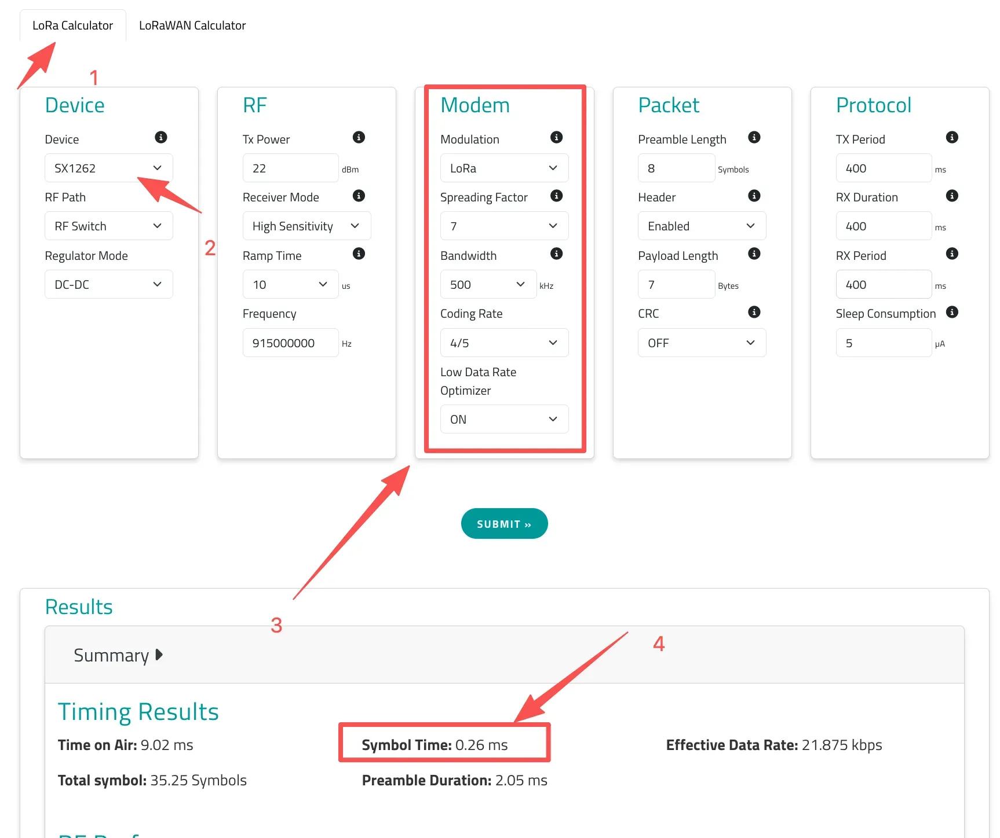

# DTU Power Consumption Calculation Guide
## 1. Introduction

This document provides a comprehensive explanation of the power consumption calculation methods for DTU devices based on the EdgeBus platform. It covers the power consumption components under different operating modes and includes detailed calculation examples.

Accurate power consumption evaluation is critical for battery-powered IoT devices. It helps to properly design battery capacity and extend device operating lifetime.

## 2. Power Consumption Components

The total power consumption of a DTU consists of the following main parts:

1. **Base Consumption**: The minimum power consumption when the device is in static or sleep state.
2. **SW Mode Consumption**: Additional power consumption generated when SleepWakeup (SW) mode is enabled and the device periodically listens for a preamble.
3. **LoRaWAN Consumption**: Power consumption generated by the LoRaWAN module during data transmission.
4. **Wired Communication Consumption**: Power consumption generated during wired communication with external devices (such as RS-485, M-Bus, 4-20mA, 0-10V interfaces), including external device power consumption and DTU interface power consumption.

## 3. Detailed Power Consumption Calculation

### 3.1 Base Consumption

The base static power consumption of all ManThink DTU products is:

$$\text{Base Consumption} = 3\,\mu\text{A}$$

### 3.2 SW Mode Consumption

#### 3.2.1 Functional Description

SW (SleepWakeup) mode reduces power consumption while meeting LoRaWAN protocol requirements by periodically listening for a preamble. Once a preamble is detected, the device wakes up and receives data.

SW mode power consumption depends on three parameters: **Period**, **Spreading Factor (SF)**, and **Bandwidth (BW)**. SF and BW jointly determine the symbol duration. The DTU listens continuously for **two symbol durations** to detect a wake-up preamble.

Key characteristics include:

- Longer period results in lower static power consumption, but longer response time.
- Longer symbol duration enables longer communication distance, but increases power consumption.

#### 3.2.2 Power Calculation

**Step 1: Obtain Symbol Time**

Use the Semtech **LoRa Calculator** online tool. Select the corresponding Spreading Factor (SF) and Bandwidth (BW), then click *Submit* to obtain the Symbol Time.

**Step 2: Calculate SW Static Power**

Assumptions:

- LoRa module and MCU receive current: 8 mA
- MCU processing time: 1 ms

Formula:

$$I_{\text{SW}} = \dfrac{(\text{Symbol Time} \times 4 + 1\,\text{ms}) \times 8\,\text{mA}}{\text{Period}}$$

**Step 3: Example**

Given:

- Period = 4000 ms
- SF = 7
- BW = 500 kHz
- Symbol Time = 0.26 ms

Calculation:

$$I_{\text{SW}} = \frac{(0.26 \times 4 + 1) \times 8}{4000} = \frac{2.04 \times 8}{4000} = \frac{16.32}{4000} = 0.00408\,\text{mA} \approx 4.08\,\mu\text{A}$$

### 3.3 LoRaWAN Consumption

LoRaWAN transmission power consumption depends on data rate and communication distance. Lower data rates and longer distances result in longer transmission times and higher power consumption. LoRaWAN transmission power can be estimated using the Semtech online calculator.

#### Key Parameters

- **Tx Power**: Transmission power level (different power levels correspond to different currents).
- **Region**: Defines Data Rate (DR) parameters for different regions.
- **Data Rate (DR)**: LoRaWAN supports adaptive data rates via ADR (Adaptive Data Rate). EdgeBus can limit the ADR adjustment range. To ensure battery lifetime, select an appropriate DR value. To reduce power consumption, increase gateway deployment density to ensure signal quality, allowing the device DR to be set to the highest level.
- **Payload Length**: Application layer data size.

After submitting parameters to the calculator, the tool provides the **single transmission energy consumption**. The static current equivalent can be calculated as:

$$I_{\text{LoRaWAN}} = \dfrac{\text{Average Tx Consumption}}{\text{Period}}$$

:::info Note
In the online tool, the unit of Average Tx Consumption should be mAh (not µAh).
:::

#### Example

Given:

- Single transmission energy consumption: 0.00753 mAh
- Transmission period: 1 hour

Calculation:

$$I_{\text{LoRaWAN}} = \dfrac{0.00753\,\text{mAh}}{1\,\text{h}} = 0.00753\,\text{mA} = 7.53\,\mu\text{A}$$

### 3.4 Wired Communication Consumption

Wired communication power consumption includes two components: external device consumption and DTU wired interface consumption.

#### 3.4.1 External Device Consumption

When the DTU supplies 15.1V via a boost circuit to drive external devices, the external device current must be converted to battery-side equivalent current. The boost efficiency is typically calculated as 70%.

**Current Conversion Formula**

$$I_{\text{battery}} = I_{\text{device}} \times \dfrac{15.1\,\text{V}}{3.6\,\text{V}} \times 0.7$$

Where:

- $I_{\text{device}}$: External device working current
- 15.1V: DTU output voltage
- 3.6V: Lithium battery nominal voltage
- 0.7: Boost efficiency

**Example**

If the external device working current is 10 mA:

$$I_{\text{battery}} = 10 \times \dfrac{15.1}{3.6} \times 0.7 \approx 10 \times 4.194 \times 0.7 \approx 29.4\,\text{mA}$$

**Communication Working Time Calculation**

External device power consumption depends not only on current but also on communication working time, which includes pre-power time, instruction transmission time, device response time, and timeout retry time.

Serial communication time is calculated as:

$$T_{\text{comm}} = \dfrac{(\text{Tx Bytes} + \text{Rx Bytes}) \times \text{Bits per Byte}}{\text{Baudrate}}$$

Since each byte typically contains 10 bits (1 start bit + 8 data bits + 1 stop bit), the formula simplifies to:

$$T_{\text{comm}} = \dfrac{(\text{Tx} + \text{Rx}) \times 10}{\text{Baudrate}}$$

**Example 1 (Normal Case)**

Given:

- Baudrate: 9600 bps
- Tx: 8 bytes
- Rx: 20 bytes

Calculation:

$$T_{\text{comm}} = \frac{(8 + 20) \times 10}{9600} = \frac{280}{9600} \approx 0.029\,\text{s} = 29\,\text{ms}$$

**Adding Preheat Time**

Default preheat time: 5 ms

Total working time:

$$T_{\text{work}} = T_{\text{preheat}} + T_{\text{comm}} = 5\,\text{ms} + 29\,\text{ms} = 34\,\text{ms}$$

**Adding Timeout (Worst Case)**

Default timeout: 2 seconds, with one retry.

Worst-case duration:

$$T_{\text{error}} = 2\,\text{s} + 2\,\text{s} + T_{\text{comm}} \approx 4\,\text{s}$$

Worst-case calculations must include this timeout duration.

**Single Reading Energy Calculation**

Single reading energy consumption:

$$Q = I_{\text{battery}} \times T_{\text{total}}$$

Converting to mAh:

$$\text{mAh} = \frac{I(\text{mA}) \times T(\text{s})}{3600}$$

**Example (Complete Calculation)**

Given:

- External device current: 10 mA
- Battery-side equivalent current: 29.4 mA
- Normal working time: 34 ms (0.034 s)

Single reading energy consumption:

$$\text{mAh} = \frac{29.4 \times 0.034}{3600} \approx 0.000277\,\text{mAh}$$

If readings occur 96 times per day (every 15 minutes):

$$0.000277 \times 96 \approx 0.0266\,\text{mAh/day}$$

#### 3.4.2 DTU Wired Interface Consumption

**RS-485 Power Consumption**

RS-485 interface working current is typically less than 12 mA. Since RS-485 does not require boost conversion, the battery-side equivalent current is directly calculated as:

$$I_{485,\text{battery}} = 12\,\text{mA}$$

The working time is the same as the external device communication time.

**Example**

Assuming working time of 34 ms (0.034 s):

$$\text{mAh} = \frac{12 \times 0.034}{3600} \approx 0.000113\,\text{mAh}$$

#### 3.4.3 Other Interface Types

| Interface Type | Typical Current | Description         |
| -------------- | --------------- | ------------------- |
| RS-485         | <12 mA          | Differential driver |
| 4-20mA         | <5 mA           | Depends on sensor   |
| 0-10V          | <5 mA           | Voltage sampling    |

For 4-20mA interfaces powered by 15.1V, apply the boost conversion formula from Section 3.4.1.

## 4. Overall Power Consumption Calculation

### 4.1 Total Communication Consumption

The total communication consumption includes all components during a complete wired communication process:

$$I_{\text{total,comm}} = I_{\text{ext,battery}} + I_{485,\text{battery}} + I_{\text{MCU}}$$

Where $I_{\text{MCU}}$ (DTU MCU working current during communication) is typically 8 mA.

**Example**

Given:

- External device battery-side equivalent current: 29.4 mA
- RS-485 interface current: 12 mA
- MCU working current: 8 mA

Total current:

$$29.4 + 12 + 8 = 49.4\,\text{mA}$$

Single communication energy consumption (assuming working time of 34 ms or 0.034 s):

$$\text{mAh} = \frac{49.4 \times 0.034}{3600} \approx 0.000466\,\text{mAh}$$

If communication occurs 96 times per day:

$$0.000466 \times 96 \approx 0.0447\,\text{mAh/day}$$

### 4.2 Daily Average Consumption

Daily average consumption is the key metric for battery lifetime assessment. It must consider the device operation in different modes and their corresponding power consumption:

$$\text{Daily Consumption (mAh/day)} = \text{Base} \times 24\,\text{h} + \text{SW Daily} + \text{LoRaWAN Daily} + \text{Wired Daily}$$

Where:

- **Base Consumption**: 3 µA (converted to mA and multiplied by 24 hours)
- **SW Mode Daily**: Calculated from the SW mode period and single consumption, for example: $I_{\text{SW}} \times 24\,\text{h}$
- **LoRaWAN Daily**: Calculated from the LoRaWAN transmission period and single transmission consumption, for example: $\frac{\text{Single Tx Energy}}{\text{Tx Period}} \times 24\,\text{h}$
- **Wired Communication Daily**: Calculated from the communication frequency and single communication consumption, for example: $\text{Single Comm Energy} \times \text{Daily Comm Count}$

**Important Note: No External Power Supply**

If the DTU does not need to supply external power (i.e., no external devices requiring DTU power), then the external device power consumption calculation from Section 3.4.1 (including $I_{\text{ext,battery}}$) should be ignored or set to zero. In this case, wired communication power consumption only includes the DTU's own wired interface power consumption (such as RS-485) and MCU working power.

### 4.3 Battery Life Estimation

When assessing battery lifetime, it is recommended to consider the following engineering margins:

- Normal operation: 90%
- Retry scenarios: 10%
- Safety margin coefficient: 20% (multiply final result by 1.2)

Battery life estimation formula:

$$\text{BatteryLife (days)} = \frac{\text{Battery Capacity (mAh)}}{\text{Daily Consumption (mAh/day)} \times (1 + \text{Safety Margin})}$$

---

## 5. Engineering Recommendations

To accurately assess and optimize DTU device power consumption, the following recommendations are suggested for practical applications:

1. **Optimize LoRaWAN Parameters**: Based on actual communication requirements and network coverage conditions, reasonably set the LoRaWAN DR value and transmission interval to balance power consumption and communication performance.
2. **Simplify External Devices**: Select low-power external devices and optimize their working modes to reduce the time and current of external power supply.
3. **Consider Abnormal Scenarios**: Fully account for abnormal timeout retries and other scenarios in power consumption assessment to ensure the device meets lifetime requirements even in worst-case conditions.
4. **Regular Monitoring**: After device deployment, regularly monitor actual power consumption data and compare it with theoretical calculations. Adjust optimization strategies promptly based on the comparison results.

---

## Appendix: Formula Reference

| Formula                                                      | Description                                  |
| ------------------------------------------------------------ | -------------------------------------------- |
| $I_{\text{SW}} = \frac{(\text{Symbol Time} \times 4 + 1\,\text{ms}) \times 8\,\text{mA}}{\text{Period}}$ | SW mode static power calculation             |
| $I_{\text{LoRaWAN}} = \frac{\text{Average Tx Consumption}}{\text{Period}}$ | LoRaWAN static power calculation             |
| $I_{\text{battery}} = I_{\text{device}} \times \frac{15.1}{3.6} \times 0.7$ | Battery-side equivalent current (with boost) |
| $T_{\text{comm}} = \frac{(\text{Tx} + \text{Rx}) \times 10}{\text{Baudrate}}$ | Serial communication time                    |
| $\text{mAh} = \frac{I(\text{mA}) \times T(\text{s})}{3600}$  | Energy consumption conversion                |
| $\text{BatteryLife} = \frac{\text{Capacity}}{\text{Daily Consumption} \times (1 + \text{Margin})}$ | Battery life estimation                      |