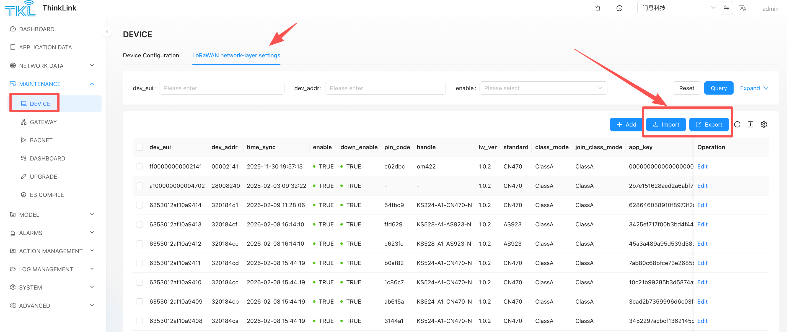

# Feature Overview
ThinkLink provides powerful batch data import and export capabilities, supporting efficient processing of core data including Thing Models, RPC commands, trigger rules, and device profiles through Excel spreadsheets. This feature is designed to significantly reduce repetitive operations in large-scale IoT deployments and improve data management efficiency.

## Core Application Scenarios
### Scenario 1: Cross-Platform Data Synchronization
Synchronize configuration data from the cloud ThinkLink platform to edge servers (TKE) or gateway-embedded systems (TKG).

 Workflow: Export Excel file from cloud platform → Execute import on target system.

### Scenario 2: Cross-Tenant Asset Transfer
Securely transfer device ownership between different organizations. For example, export device profiles from Organization A and import them into Organization B's account. 

⚠️ **Note**: Some data types have global uniqueness constraints within the same platform (e.g., LoRaWAN device profiles). Cross-organization transfer requires deleting the corresponding data from the source organization first.

## Supported Data Types
| Function Module | Description |
| --- | --- |
| Device Configuration | Device parameters and communication settings |
| LoRaWAN Profiles | Core device archives including DevEUI, AppKey, etc. |
| Thing Models | Device data parsing and business model definitions |
| RPC Commands | Remote device control command sets |
| Linkage Models | Automation rules and trigger conditions |
| Device Templates | Standardized device configuration templates |

---

## Operation Guide (Using LoRaWAN Profiles as Example)

### Export Data
1. Navigate to the **LoRaWAN Profiles** management page
2. Select target devices using the left-side checkboxes (leave unselected to export all profiles by default)
3. Click the **Export** button; the system automatically generates an Excel file

### Import Data
1. Navigate to the **LoRaWAN Profiles** management page
2. Click the **Import** button
3. Select an Excel file in the required format
4. The system automatically parses and completes the data write operation

---

## Key Considerations
### 1. Data Uniqueness Constraints
All data carries a globally unique identifier. Taking LoRaWAN profiles as an example, **DevEUI is unique within a single ThinkLink instance** and can only exist under one organization. When migrating across organizations, you must first delete the data from the source organization before successfully importing to the target organization.

### 2. Public Model Management
ThinkLink includes rich built-in public Thing Models, RPC command sets, and device templates. Only the **admin account** has management privileges. When importing public models into standalone deployment environments or gateway systems, you must log in to the system platform using the admin account to execute the operation.

### 3. Data Conflict Resolution Mechanism
| System Status | Processing Logic |
| --- | --- |
| ID does not exist | Create new data record |
| ID already exists | **Complete overwrite** of original data (based on Excel content) |

⚠️ **Risk Warning**: Import operations are irreversible. It is recommended to perform a complete backup of existing data before execution to avoid configuration loss due to misoperation.

---

## Best Practice Recommendations
+ **Regular Backups**: Export current configurations as backup before executing batch imports
+ **Phased Validation**: For first-time imports, test with a small batch of data first; proceed with full import only after verification
+ **Permission Control**: Public model changes should be centrally managed through the admin account to avoid multi-account operation conflicts

