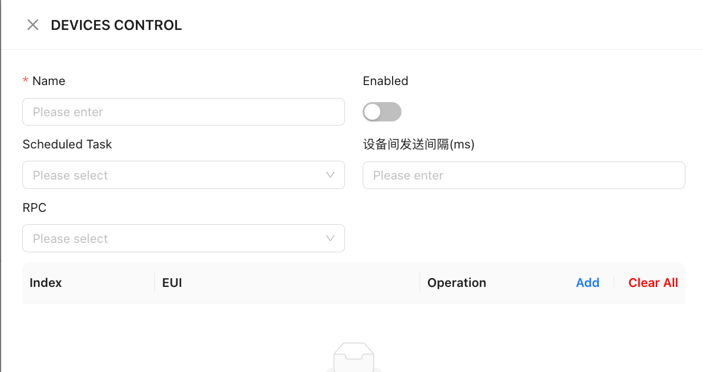

# 1. Device Action
Supports multiple operations on devices, including: RPC calls, MCP command issuance, report generation, notification sending, alarm checks, etc.

Device action requires binding to scheduled tasks and supports the following scenarios:

+ Timed action for single or multiple devices (e.g., triggering operations at fixed times).
+ Schedule tasks (e.g., hourly parameter collection, daily device attribute updates).

## 1.1. Configuration
When adding an execution event, the following information must be provided:

1. **Basic Information**+ **Name**: Custom name for the execution event.
+  **Enable Switch**: Controls whether the event is active.
2. **Task Binding** + **Scheduled Task**: Select from the dropdown list (a preconfigured task matching business requirements must be created first).
3. **Execution Settings** + **Device Send Interval** (for batch operations): Sets the time interval between device executions.
+  **RPC Operation**: Select specific commands and enter necessary parameters (if applicable).
4. **Device Scope** + **Add Target Devices** (supports single or batch selection).

<!-- 这是一张图片，ocr 内容为：DEVICES CONTROL ENABLED NAME PLEASE ENTER 设备间发送间隔(MS) SCHEDULED TASK PLEASE ENTER PLEASE SELECT RPC PLEASE SELECT EUI OPERATION ADD CLEAR ALL INDEX -->

