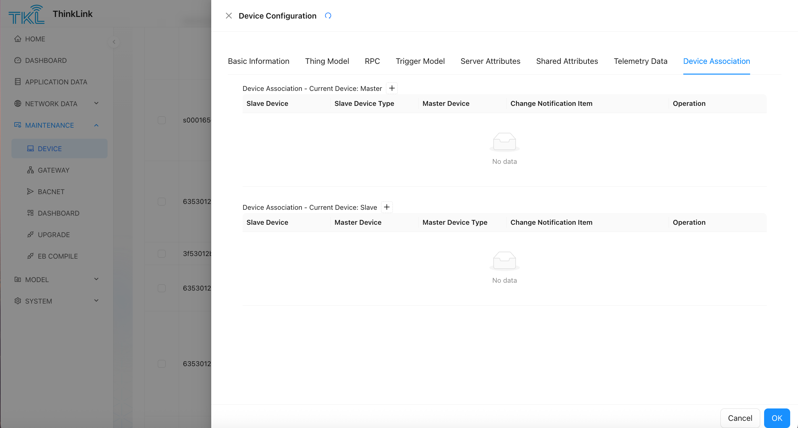

# 1. Device Management
ThinkLink (TKL) supports the access and unified management of multiple device types, including LoRaWAN devices, sub-devices, virtual devices, and external devices connected through third-party protocols. The system provides flexible equipment lifecycle management capabilities, including equipment file configuration, object model mounting, attribute setting, and Equipment Association establishment. 

+ **[Note 1]** ThinkLink  supports LoRaWAN devices, sub-devices, virtual devices, and external devices. 
+ **[Note 2]** When adding a device, if a third-party device other than LoRaWAN is selected, the communication interface protocol must comply with the ThinkLink protocol standard. 
+ **[Note 3]** For LoRaWAN devices connected through ThinkLink NS, you need **complete device registration in "LoRaWAN device file" first**, and then the corresponding `devEUI `add to the platform device list. 

## 1.1. LoRaWAN Device Profile
For all LoRaWAN devices that use the OTAA or ABP mode, you must create a device file in advance in this module. This profile is used by the network server (NS) for device authentication, key management, and communication scheduling. 

### 1.1.1. Add a single LoRaWAN device document
<!-- 这是一张图片，ocr 内容为：TIKL THINKLINK DEVICE DOCUMENT CONFIGURATION *JOIN_MODE R DEVICE DEV EUI DASHBOARD OTAA PLEASE ENTER DEVICE CONFIGURATION LORAWAN DOCUMENT WSTANDARD 目 APPLICATION DATA PLEASE SELECT PLEASE ENTER NETWORK DATA PLEASE ENTER DEV_EUI: DEV_ADDR: LW_VER ENABLE @MAINTENANCE 1.0.2 DEVICE DOWN_ENABLE CLASS_MODE PLEASE SELECT 品 GATEWAY DEV_ADDR TIME_SYNC DEV_EUI ENABLE DOWN HANDLE JOIN CLASS MODE WBACNET 6353012AF10A1806 TRU TRUE 2025-10-10 15:31:52 320166E9 PLEASE ENTER PLEASE SELECT DASHBOARD APPS KEY 6353012AF10A1805 TRU 2025-10-27 19:07:33 TRUE 320166E8 UPGRADE PLEASE ENTER PLEASE ENTER 6353012AF1099301  32015D19 2025-10-10 09:34:47 TRUE TRU PP EB COMPILE RXIDR_OFFSET NWKS KEY 6353012AF1094217 32014930 2025-09-26  16:37:07 TRUE PLEASE ENTER PLEASE ENTER 图 MODEL RX_DELAY 6353012AF1093064 2025-09-22 15:25:52 RX2DR 320144AF TRUE @SYSTEM PLEASE ENTER 6353012AF1093063 -10-1114:45:32 TRUE 2025-10 TRU 320144AE RX2_FREQ RX_DELAY_JOIN 6353012AF1093062 09-22  15:52 RUE PLEASE ENTER PLEASE ENTER 6353012AF1090498 TRUE 5:05:01 BATCH MODEL PLEASE ENLER PLEASE ENLER 6353012AF1090468 TRU 10:07:57 TRU TRUE 6353012AF1090142 2025-10-11 05:10:02 32013943 OK CANCEL -->


| field Name  | whether required  | description  |
| --- | --- | --- |
| `devEui ` | required  | the unique device identifier (EUI), which is globally unique and cannot be repeated.  |
| `devAddr ` | required in ABP mode  | device addresses to ensure no conflicts in the network.  |
| `enable ` | required (Default: `TRUE `) | Whether the device is enabled. `TRUE `means enabled, `FALSE `indicates disabled.  |
| `down_enable ` | required (Default: `TRUE `)  | whether downlink communication is allowed. `TRUE `allowed, `FALSE `prohibited.  |
| `lw_ver ` | required  | the LoRaWAN protocol version. Recommended to fill in `1.0.2 `compatible with most 1.0.3 and some 1.0.4 area protocols.  |
| `standard ` | required  | band standard, optional:    CN470    EU433    EU868    AS923    AU915    US902  |
| `class_mode` | Required (Default: `ClassA `)  | equipment normal working mode, optional: <br/>`ClassA `or `ClassC `.  |
| `join_class_mode ` | required (Default: `ClassA `)  | the  mode after join the network shall be consistent with the actual behavior of the equipment.  |
| `app_key ` | required in OTAA mode  | OTAA encryption key (application  key).  |
| `apps_key ` | required in ABP mode  | application session key.  |
| `nwks_key ` | required in ABP mode  | network session key.  |
| `rx1dr_offset ` | required (default Auto-filled based on band)  | the DR offset of the downlink window RX1 varies in different regions.  |
| `rx2dr ` | required (default Auto-filled based on band)  | the transmission Rate of the RX2 window  |
| `rx_delay ` | required (Default: 1)  | the delay time (unit: seconds) of the first downlink receiving window after the uplink data.  |
| `rx_delay_join ` | required (Default: 5)  | the downlink response delay time (in seconds) in the Join process.  |
| `rx2_freq ` | required (default Auto-filled based on band)  | the fixed frequency used by the RX2 receive window depends on the regional standard.  |


>   **Prompt** when adding a new device file, simply select the correct `standard `(Band) and 
>
> `lw_ver `(Protocol version), the remaining parameters are automatically filled with the default values of the corresponding standard, simplifying the configuration process. 
>

### 1.1.2. Bulk import of LoRaWAN devices
For large-scale deployment scenarios, you can import LoRaWAN device files in batches through Excel tables. 

1. Download the standard template file (refer to the sample format : [mt_sdev_pf_macs--1756347416255.xlsx](https://mensikeji.yuque.com/attachments/yuque/0/2025/xlsx/45351741/1758943470779-38316891-32b2-431b-b89a-3d9c708e9398.xlsx)); 
2. Fill in the equipment information according to the field requirements; 
3. Upload to the system after verification; 
4. The system automatically verifies and imports equipment files.

## 1.2. Add device
### 1.2.1. Add a device
after completing the configuration of the LoRaWAN device file, you can register it as a platform management device. 

| Field  | description  |
| --- | --- |
|**EUI** | the unique device number must be unique in the ThinkLink system.  |
|**Name** | user-defined device name for easy identification and management.  |
|**Device Type** | it can be a device or an asset, and the asset is a virtual body after the variable value is recombined.  |
|**Configuration Templates** | you can select preset configuration templates, fast binding model, RPC and other function configurations.  |


> ✅**Operational recommendations**: The use of configuration templates can greatly improve the efficiency of equipment online, especially suitable for batch deployment of equipment of the same model. 
>

<!-- 这是一张图片，ocr 内容为：ADD DEVICE EUI NAME PLEASE ENTER PLEASE ENTER DEVICE TYPE DEVICE TEMPLATE DEVICE DEFAULT DATA SOURCE LORAWAN CANCEL OK -->


### 1.2.2. Import by excel file
Devices can be imported in bulk using an Excel spreadsheet. The procedure is as follows:

1. Select an existing device and click "Export" to download its profile information as a template;
2. Fill in or modify the information for other devices based on this template,ensuring the **`EUI`** field is completed (**`EUI`**  serves as the unique identifier for each device);
3. If certain parameters do not need to be imported or updated, the corresponding columns can be deleted from the spreadsheet;
4. After editing the file, proceed with the bulk import:
+ **If a device with the same EUI already exists in the system**: The system will update the corresponding parameters of that device;
+ **If no device with the given EUI exists**: A new device will be added.

> ⚠️ Ensure that each device's EUI is unique and accurate to guarantee correct import results.
>

## 1.3. Device Details Page Function Module
After entering any device details page, you can perform the following advanced configuration and monitoring operations. 

<!-- 这是一张图片，ocr 内容为：TIKL THINKLINK DEVICE CONFIGURATION HOME DASHBOARD TELEMETRY DATA THING MODEL RPCTRIGGERMODEL BASIC INFORMATION SERVER ATTRIBUTES DEVICE ASSOCIATION SHARED ATTRIBUTES APPLICATION DATA MC11-IR DTU 6353012AF1099301 EUI NAME NETWORK DATA S000165 MAINTENANCE STATUS DEVICE TYPE ONLINE DEVICE 2025-10-28 10:10:10 PARENT EUI ACTIVE TIME 品 GATEWAY BACNET HEARTBEAT DTUX 86400 MANTHINK TAGS 6353012 PERIOD(S) 昭 DASHBOARD REAL-TIME UPGRADE THINGSBOARD STORAGE 31530121 EB COMPILE BACNET HOMEASSISTANT MODEL 6353012 GEOGRAPHIC # SYSTEM THIRDPARTY PLEASE SELECT LOCATION 6353012 OK CANCEL -->


### 1.3.1. Add model
+ click the Add button to mount an object model for the device. 
+ **One device can mount multiple Thing models** to parse different types of data messages (such as sensor data, status reporting, event notifications, etc.). 
+ The Thing Model is responsible for parsing the raw binary payload into structured application-layer data (such as temperature, humidity, switch state, etc.). 

### 1.3.2. Add RPC
+ Supports multiple remote procedure call (RPC) models for device mounting. 
+ It is used to issue reverse control instructions to the equipment (such as remote restart, parameter modification, firmware upgrade, etc.). 

### 1.3.3. Server Attributes
+ it is an application-layer logical parameter and is independent of the actual data reported by the device. 
+ Examples: temperature and humidity alarm threshold, heartbeat detection period, user comments, etc. 
+ Can be called in a TS script or RPC to participate in logical decisions. 

>  Users can manually add or delete server attributes through the interface. 
>

### 1.3.4. Shared Attributes
+ it is stored on the device side, but can be updated in both the server and the device side. 
+ Typical uses: Device working mode, sampling interval, OTA update flag, etc. 
+ It can be extracted and synchronized to the platform when the thing model parses the upstream message. 

### 1.3.5. Telemetry Data
+ the latest telemetry information reported by the device and its timestamp are saved in real time. 
+ Including temperature, voltage, position, status code and other dynamic data. 

### 1.3.6. Device Association
<!-- 这是一张图片，ocr 内容为：TKL THINKLINK DEVICE CONFIGURATION 合 HOME ) DASHBOARD THING MODEL RPC TELEMETRY DATA BASIC INFORMATION SERVER ATTRIBUTES TRIGGER MODEL SHARED ATTRIBUTES DEVICE ASSOCIATION 目 APPLICATION DATA DEVICE ASSOCIATION-CURRENT DEVICE:MASTER+ NETWORK DATA CHANGE NOTIFICATION LTEM SLAVE DEVICE SLAVE DEVICE TYPE MASTER DEVICE OPERATION 5000165 @ MAINTENANCE 日 DEVICE NO DATA GATEWAY S BACNET 6353012 DEVICE ASSOCIATION-CURRENT DEVICE:SLAVE/+ 昭 DASHBOARD CHANGE NOTIFICATION LTEM OPERATION MASTER DEVICE MASTER DEVICE TYPE SLAVE DEVICE OF UPGRADE 3F530126 OF EB COMPILE BMODEL NO DATA 6353012 粤 SYSTEM 6353012 OK CANCEL -->


+ you can add slave devices to master devices or specify master devices for slave devices to build device topology. 
+ Association type support: 
    - slave → Master 
    - master device ← Multiple slave devices

When the following data of the associated device changes, the system will automatically trigger a notification to the master device: 

| change Type  | trigger condition  |
| --- | --- |
| telemetry Data  | report New telemetry from Device  |
| shared Properties  | platform or device modification shared attributes  |
| server Properties  | business system changes server attributes  |


  the master device can process these change data through the script in the thing model to realize functions such as aggregate calculation and linkage triggering. 

### 1.3.7. Asset Class Model Example: Multi-device Temperature and Humidity Average Calculation
> The following is a typical application case of the asset-level thing model: the main device represents the "air conditioning area", and the four temperature and humidity sensors are subordinate devices. Whenever any slave device reports data, the master device automatically calculates the average temperature and humidity of the current area. 
>

Scenario Description: 

+ the master device is associated with 4 slave devices; 
+ each slave equipment shall regularly report its own temperature and humidity (t, h); 
+ the master device model script aggregates data and updates avgT (average temperature), avgH (average humidity) in real time. 

The sample script is as follows: 

```javascript
let preTelemetry = device.telemetry_data[thingModelId];
let tempetrature;
let humidity;
if (!noticeAttrs.telemetry_data) {
        return {
            telemetry_data: null,
            server_attrs: null,
            shared_attrs: null,
        }
  }
msg.thing_model.forEach((tid) => {
  if (msg.telemetry_data[tid].t != null) {
    tempetrature = msg.telemetry_data[tid].t;
    humidity = msg.telemetry_data[tid].h;
  }
});

let avgT = device.telemetry_data[thingModelId]?.avgT || 0;
let avgH = device.telemetry_data[thingModelId]?.avgH || 0;

let attrs_server = {
  [msg.eui]: {
    "tempetrature": tempetrature,
    "humidity": humidity
  }
};

if (avgT === 0) avgT = tempetrature;
if (avgH === 0) avgH = humidity;

avgT = (avgT + tempetrature) / 2;
avgH = (avgH + humidity) / 2;

let attrs_telemetry = {
  "avgT": avgT,
  "avgH": avgH
};

return {
  telemetry_data: attrs_telemetry,
  server_attrs: attrs_server,
  shared_attrs: null,
};
```

> this model is widely used in scenarios that require "regional data aggregation", such as building environmental monitoring, cold chain storage, and smart agriculture. 
>
