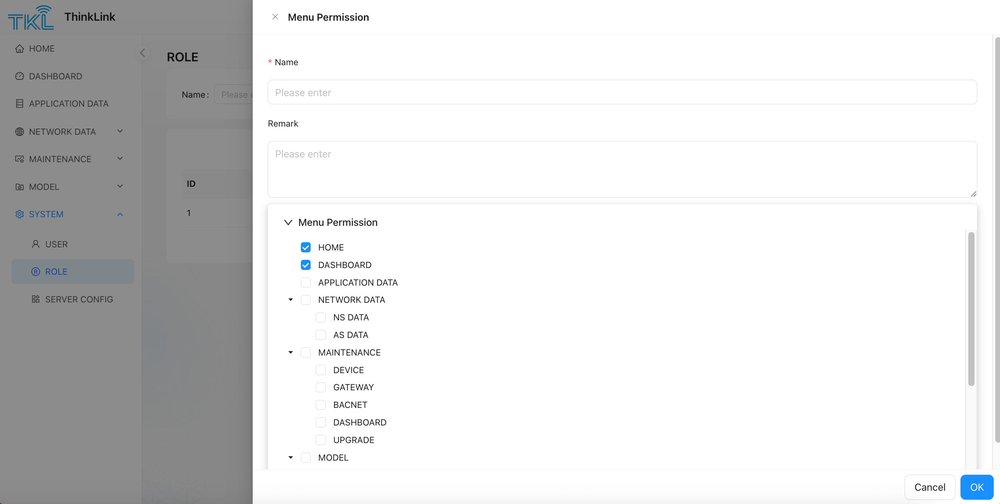

# 1. Role Management
**menu Path**: SYSTEM → ROLE  

thinkLink(TKL) provides the default `admin `the role, which has the highest operation permissions for all functions in the current organization and cannot be deleted. 

Users can add custom roles in the following ways: 

1. Click **"Add"** button to pop up the new role configuration window.
2. Enter a role name and optionally a description.
3. In the permission configuration area, assign specific access permissions to the role by checking the corresponding menu item.
4. Click **"OK"** to complete role creation. 

After the role is created, the role can be assigned to the specified user in user management to achieve fine-grained permission control. 

> [Hint] It is recommended to reasonably divide role permissions according to actual business needs to avoid excessive concentration or insufficient permissions. 
>

<!-- 这是一张图片，ocr 内容为：TIKL THINKLINK XMENU PERMISSION HOME ROLE NAME DASHBOARD PLEASE ENTER NAME: APPLICATION DATA REMARK NETWORK DATA PLEASE ENTER MAINTENANCE 圆 MODEL SYSTEM MENU PERMISSION RUSER HOME DASHBOARD ROLE APPLICATION DATA 路 SERVER CONFIG NETWORK DATA NS DATA AS DATA MAINTENANCE DEVICE GATEWAY BACNET DASHBOARD UPGRADE MODEL OK CANCEL -->

