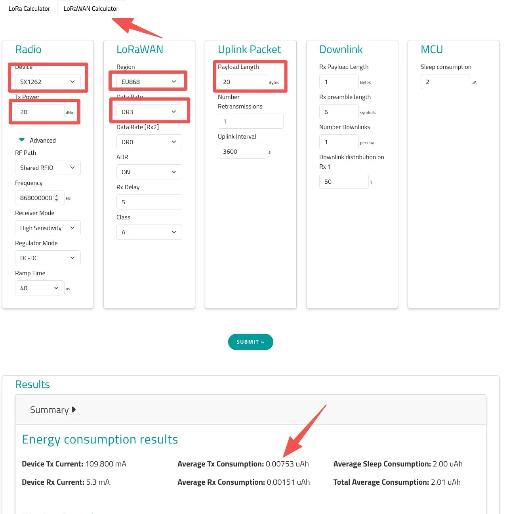

# DTU 功耗计算
## 1. 引言

本文档旨在详细说明基于 EdgeBus 的 DTU 设备的功耗计算方法，涵盖了设备在不同工作模式下的功耗组成及计算示例。准确评估功耗对于电池供电的物联网设备至关重要，有助于合理设计电池容量，延长设备续航时间。

## 2. 功耗组成

DTU 的总功耗由以下几个主要部分组成：

1. **基础功耗**：设备在静态或休眠状态下的最低功耗。
2. **SW 模式功耗**：当设备开启 SleepWakeup (SW) 模式时，周期性侦听 preamble 产生的额外功耗。
3. **LoRaWAN 部分功耗**：LoRaWAN 模块在发送数据时产生的功耗。
4. **有线通信部分功耗**：与外部设备进行有线通信（如 RS-485、M-Bus、4-20mA、0-10V 接口）时产生的功耗，包括外部设备自身功耗和 DTU 接口功耗。

## 3. 各部分功耗详细计算

### 3.1 基础功耗

门思科技所有 DTU 类产品的基础静态功耗均为 **3uA**。

### 3.2 SW 模式功耗

#### 3.2.1 功能描述

SW (SleepWakeup) 模式旨在满足 LoRaWAN 协议要求的同时，通过周期性侦听 preamble 来降低功耗。当检测到 preamble 后，设备被唤醒并接收数据。SW 模式的功耗受 **周期 (Period)**、**扩频因子 (SF)** 和 **带宽 (BW)** 三个参数影响。SF 和 BW 共同决定了一个 symbol 的时长。DTU 通过连续侦听两个 symbol 的时长来判断是否存在唤醒 preamble 数据。

- **周期越长**：SW 模式对应的静态功耗越小，但响应时间越长。
- **symbol 时长越大**：通信距离越远，侦听时间越长，功耗也随之增加。

#### 3.2.2 功耗计算

1. **获取 Symbol 时长**：  
   利用 Semtech 提供的在线计算工具 [LoRa Calculator](https://www.semtech.com/design-support/lora-calculator) 获取 Symbol 时长。在工具中选择对应的 Spreading Factor (SF) 和 Bandwidth (BW) 后，点击 Submit 即可获得。

2. **计算 SW 静态功耗**：  
   LoRa 模块和 MCU 的接收功耗可按 **8mA** 计算，MCU 处理时间为 **1ms**。SW 模式的静态功耗计算公式如下：

$$I_{SW} = \frac{(\text{Symbol Time} \times 4 + 1 \text{ ms}) \times 8 \text{ mA}}{\text{Period}}$$

3. **示例**：  
   如果周期为 4000ms，SF=7，BW=500kHz，假设 Symbol Time 为 0.26ms，则对应的静态功耗为：

$$I_{SW} = \frac{(0.26 \times 4 + 1) \times 8}{4000} = \frac{2.04 \times 8}{4000} = \frac{16.32}{4000} = 0.00408 \text{ mA} \approx 4.08 \text{ µA}$$

### 3.3 LoRaWAN 部分功耗

LoRaWAN 的特点是速率越低、通信距离越远，发送时间越长，功耗越大。LoRaWAN 的功耗估算同样可以使用 Semtech 的在线工具进行计算。配置相关参数后，提交即可获得单次发送的耗电量。

**关键参数说明**：

- **Tx Power (发射功率)**：根据标准选择，不同的发射功率对应不同的电流。
- **Region (区域)**：选择不同的区域标准，对应的数据速率 (Data Rate) 定义不同。
- **Data Rate (数据速率)**：LoRaWAN 可以在不同的 DR 值之间自适应。EdgeBus 可以限制 ADR (Adaptive Data Rate) 的调整范围。为保证电池寿命，可选择合适的 DR 值；若要降低功耗，则需增大网关部署密度以保证信号质量，从而将设备 DR 值调整到最高。
- **Payload Length (应用层数据长度)**：发送的应用层数据长度。

提交后可获取相关功耗数据。按照发送周期，可换算为对应的静态功耗：

$$I_{LoRaWAN} = \frac{\text{Average Tx Consumption}}{\text{Period}}$$

:::info 注意
当前的在线工具中 `Average Tx Consumption` 的单位应为 mAh 而不是 uAh。
:::

**示例**：  
如果单次发送耗电量为 0.00753mAh，每 1 小时发送一次数据，则对应的静态功耗为：

$$I_{LoRaWAN} = \frac{0.00753 \text{ mAh}}{1 \text{ h}} = 0.00753 \text{ mA} = 7.53 \text{ uA}$$

### 3.4 有线通信部分功耗

有线通信功耗包括外部设备功耗和 DTU 自身有线通信接口功耗。

#### 3.4.1 外部设备功耗

当 DTU 通过升压电路对外提供 15.1V 电压以驱动外部设备时，需要将外部设备的电流换算为电池侧的等效电流。常规升压效率按 70% 计算。

1. **工作电流换算**：  
   电池侧电流换算公式：

$$I_{battery} = I_{device} \times \frac{15.1 \text{ V}}{3.6 \text{ V}} \times 0.7$$

2. 其中：
   - $I_{device}$：外部设备工作电流
   - 15.1V：DTU 对外供电电压
   - 3.6V：锂电池标称电压
   - 0.7：升压效率

**示例**：  
外部设备工作电流为 10mA，则电池侧等效电流为：

$$10 \text{ mA} \times \frac{15.1}{3.6} \times 0.7 \approx 29.4 \text{ mA}$$

3. **通信工作时间计算**：  
   外部设备功耗不仅取决于电流，还与通信工作时间相关，包括预热时间、指令发送时间、设备响应时间、超时重查时间等。
   - **串口通信时间** ($T_{comm}$)：

$$T_{comm} = \frac{(\text{发送字节数} + \text{接收字节数}) \times \text{每字节位数}}{\text{波特率}}$$

- 通常每字节位数为 10 bit (1 起始位 + 8 数据位 + 1 停止位)，因此简化为：

$$T_{comm} = \frac{(Tx + Rx) \times 10}{\text{Baudrate}}$$

- **示例 1 (正常情况)**：  
  波特率 = 9600bps，发送 8 字节，接收 20 字节。

$$T_{comm} = \frac{(8 + 20) \times 10}{9600} = \frac{280}{9600} \approx 0.029 \text{ s} = 29 \text{ ms}$$

- **加入预热时间** ($T_{preheat}$)：  
  默认预热时间为 5ms。  
  总工作时间 ($T_{work}$)：

$$T_{work} = T_{preheat} + T_{comm} = 5 \text{ ms} + 29 \text{ ms} = 34 \text{ ms}$$

- **加入异常超时情况** ($T_{error}$)：  
  默认超时时间为 2 秒，超时后重查一次。在最坏情况下，异常情况总时间约为：

$$T_{error} = 2 \text{ s} + 2 \text{ s} + T_{comm} \approx 4 \text{ s}$$

- 在进行最坏情况计算时，必须计入此部分时间。
- **单次抄读完整工作时间模型** ($T_{total}$)：

$$T_{total} = T_{preheat} + T_{comm} + T_{timeout}$$

4. **单次抄读能量计算**：  
   单次抄读电量消耗 ($Q$)：

$$Q = I_{battery} \times T_{total}$$

5. 单位为 As (库仑)。换算成 mAh：

$$\text{mAh} = \frac{I(\text{mA}) \times T(\text{s})}{3600}$$

6. **示例 (完整计算)**：  
   假设外部设备电流 10mA，电池侧等效电流 29.4mA，正常工作时间 34ms (0.034s)。  
   单次抄读耗电：

$$\text{mAh} = \frac{29.4 \text{ mA} \times 0.034 \text{ s}}{3600} \approx 0.000277 \text{ mAh}$$

7. 如果每天抄读 96 次 (每 15 分钟一次)：

$$0.000277 \text{ mAh} \times 96 \approx 0.0266 \text{ mAh/天}$$

#### 3.4.2 DTU 有线通信接口功耗

DTU 自身有线通信接口（如 RS-485）在工作时也会产生功耗。

1. **RS-485 功耗**：  
   RS-485 接口工作电流通常小于 12mA。由于 RS-485 接口通常不需要升压，其电池侧等效电流直接按工作电流计算：

$$I_{485,battery} = 12 \text{ mA}$$

2. 工作时间与外部设备通信时间一致。

3. **单次 RS-485 耗电**：  
   假设工作时间为 34ms (0.034s)。

$$\text{mAh} = \frac{12 \text{ mA} \times 0.034 \text{ s}}{3600} \approx 0.000113 \text{ mAh}$$

#### 3.4.3 其他接口功耗说明

| 接口类型 | 典型电流 | 说明     |
| -------- | -------- | -------- |
| RS-485   | <12mA    | 差分驱动 |
| 4-20mA   | <5mA     |          |
| 0-10V    | <5mA     |          |

对于 4-20mA 等接口，若 DTU 提供 15.1V 供电，需要按 3.4.1 节的升压公式换算成电池电流。

## 4. 整体功耗计算方法

DTU 的整体功耗是各部分功耗的叠加。在计算整体功耗时，需要区分设备是否对外供电以及对外供电的频率和时长。

### 4.1 整体通信功耗

整体通信功耗是指在一次完整的有线通信过程中，所有相关组件（外部设备、DTU 接口、DTU MCU）的总功耗。

1. **综合电流**：

$$I_{total,comm} = I_{ext,battery} + I_{485,battery} + I_{MCU}$$

2. 其中 $I_{MCU}$ 为 DTU MCU 在通信期间的工作电流，可按 8mA 计算。**示例 (完整通信系统)**：  
   假设外部设备电池侧等效电流 29.4mA，RS-485 接口电流 12mA，MCU 工作电流 8mA。  
   总电流：

$$29.4 \text{ mA} + 12 \text{ mA} + 8 \text{ mA} = 49.4 \text{ mA}$$

3. **单次通信耗电**：  
   假设单次通信总工作时间 $T_{total}$ 为 34ms (0.034s)。

$$\text{mAh} = \frac{I_{total,comm} \times T_{total}}{3600} = \frac{49.4 \text{ mA} \times 0.034 \text{ s}}{3600} \approx 0.000466 \text{ mAh}$$

4. 如果每天通信 96 次：

$$0.000466 \text{ mAh} \times 96 \approx 0.0447 \text{ mAh/天}$$

### 4.2 日均总功耗计算

日均总功耗是评估电池寿命的关键指标。它需要综合考虑设备在不同模式下的工作时长和对应的功耗。

$$\text{日均总耗电量 (mAh/天)} = \text{基础功耗} \times 24 \text{ h} + \text{SW 模式日均耗电量} + \text{LoRaWAN 日均耗电量} + \text{有线通信日均耗电量}$$

其中：

- **基础功耗**：3uA (转换为 mA 后乘以 24 小时)。
- **SW 模式日均耗电量**：根据 SW 模式的周期和单次功耗计算，例如 $I_{SW} \times 24 \text{ h}$。
- **LoRaWAN 日均耗电量**：根据 LoRaWAN 发送周期和单次发送耗电量计算，例如 $\frac{\text{单次发送耗电量}}{\text{发送周期}} \times 24 \text{ h}$。
- **有线通信日均耗电量**：根据有线通信的频率和单次通信耗电量计算，例如 $\text{单次通信耗电量} \times \text{每天通信次数}$。

**重要说明：不对外供电的情况**

如果 DTU **不需要对外供电**（即不连接需要 DTU 供电的外部设备），则 **3.4.1 外部设备功耗** 部分的计算（包括 $I_{ext,battery}$）应被忽略或视为零。此时，有线通信的功耗仅包含 DTU 自身有线通信接口功耗（如 RS-485 功耗）和 MCU 工作功耗。

### 4.3 电池寿命估算

在进行电池寿命评估时，建议考虑以下工程裕量：

- 正常工作占比：90%
- 异常重试占比：10%
- 裕量系数：20% (即最终结果乘以 1.2)

最终寿命估算公式：

$$\text{BatteryLife (天)} = \frac{\text{电池容量 (mAh)}}{\text{日均总耗电量 (mAh/天)} \times (1 + \text{裕量系数})}$$

## 5. 工程建议

为了更准确地评估和优化 DTU 设备的功耗，建议在实际应用中：

- **优化 LoRaWAN 参数**：根据实际通信需求和网络覆盖情况，合理设置 LoRaWAN 的 DR 值和发送周期，以平衡功耗与通信性能。
- **精简外部设备**：尽量选择低功耗的外部设备，并优化其工作模式，减少对外供电的时间和电流。
- **考虑异常情况**：在功耗评估中充分考虑异常超时重试等情况，以确保在最坏情况下设备仍能满足续航要求。
- **定期监测**：在设备部署后，定期监测实际功耗数据，与理论计算值进行对比，及时调整优化策略。