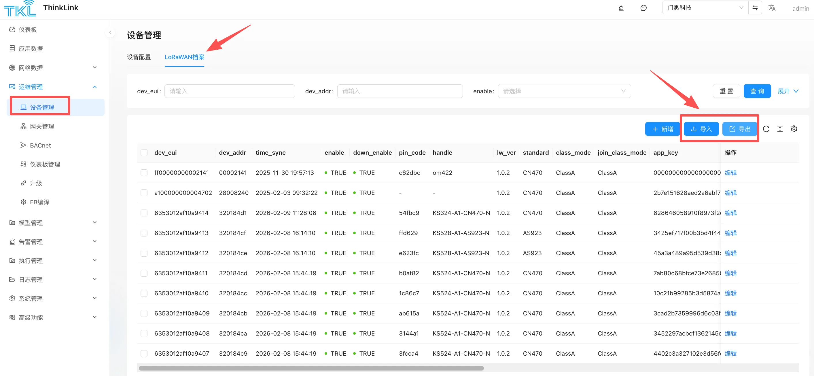

# 功能概述
ThinkLink 提供强大的批量数据导入导出功能，支持通过 Excel 表格高效处理物模型、RPC 指令、联动规则、设备档案等核心数据。该功能旨在显著降低大规模 IoT 部署中的重复性操作工作量，提升数据管理效率。

## 核心应用场景
### 场景一：跨平台数据同步
将云端 ThinkLink 平台的配置数据同步至边缘服务器（TKE）或网关内置系统（TKG）。操作流程：在云平台导出 Excel 文件 → 在目标系统执行导入。

### 场景二：跨租户资产转移
实现设备所属权在不同组织间的安全转移。例如将 A 组织的设备档案导出后，导入至 B 组织账户。

⚠️ **注意**：同一平台下部分数据具有全局唯一性约束（如 LoRaWAN 设备档案），跨组织转移前需先在原组织删除对应数据。

## 支持的数据类型
| 功能模块 | 说明 |
| --- | --- |
| 设备配置 | 设备参数与通信配置 |
| LoRaWAN 档案 | 终端设备的 DevEUI、AppKey 等核心档案 |
| 物模型 | 设备数据解析与业务模型定义 |
| RPC 指令 | 远程设备控制命令集 |
| 联动模型 | 自动化规则与触发条件 |
| 设备模板 | 标准化设备配置模板 |

---

## 操作指南（以 LoRaWAN 档案为例）

### 导出数据
1. 进入 **LoRaWAN 档案** 管理页面
2. 在左侧复选框勾选目标设备（不选则默认导出全部档案）
3. 点击 **导出** 按钮，系统自动生成 Excel 文件

### 导入数据
1. 进入 **LoRaWAN 档案** 管理页面
2. 点击 **导入** 按钮
3. 选择符合格式要求的 Excel 文件
4. 系统自动解析并完成数据写入

---

## 关键注意事项
### 1. 数据唯一性约束
所有数据均带有全局唯一标识。以 LoRaWAN 档案为例，**DevEUI 在同一 ThinkLink 实例中具有唯一性**，仅允许存在于单一组织下。跨组织迁移时，必须先删除源组织数据，方可成功导入目标组织。

### 2. 公共模型管理
ThinkLink 内置丰富的公共物模型、RPC 指令集及设备模板，仅 **admin 账户** 具备管理权限。在独立部署环境或网关系统中导入公共模型时，必须使用 admin 账户登录系统平台方可执行。

### 3. 数据冲突处理机制
| 系统状态 | 处理逻辑 |
| --- | --- |
| ID 不存在 | 新增数据记录 |
| ID 已存在 | **完全覆盖**原有数据（以 Excel 内容为准） |

⚠️ **风险提示**：导入操作不可逆，建议在执行前对现有数据进行完整备份，避免误操作导致配置丢失。

---

## 最佳实践建议
+ **定期备份**：在执行批量导入前，导出当前配置作为备份
+ **分步验证**：首次导入建议先使用小批量数据测试，确认无误后再执行全量导入
+ **权限管控**：公共模型变更建议通过 admin 账户集中管理，避免多账户操作冲突

