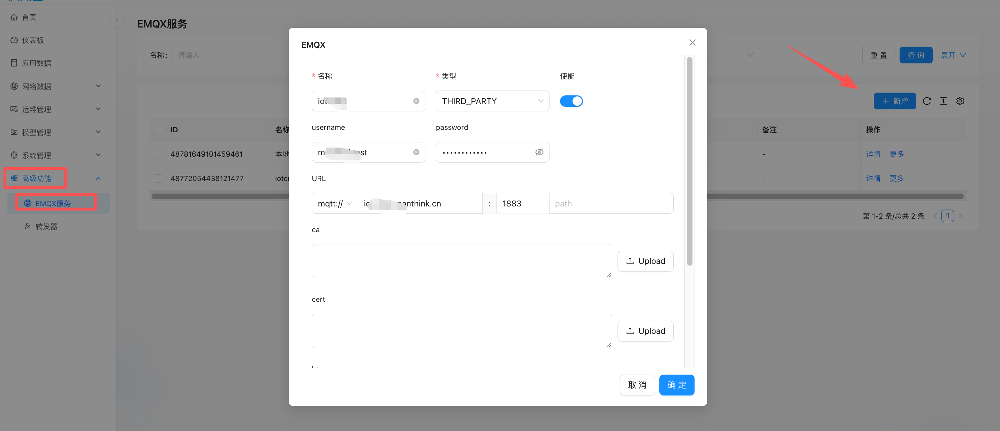
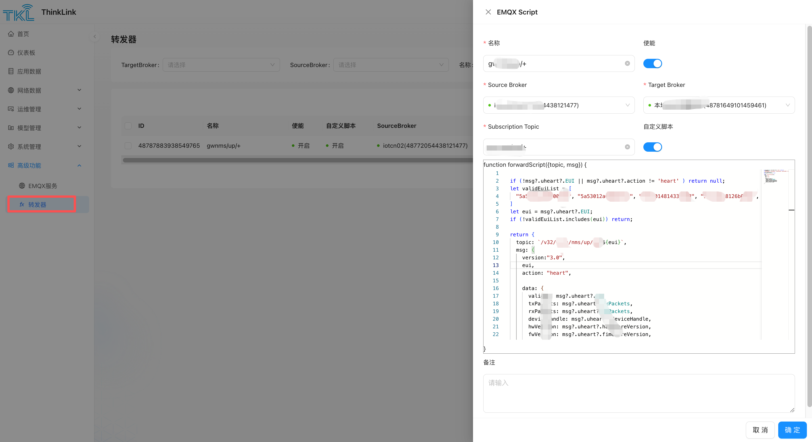

#MQTT 转发器

MQTT转发器是用于实现第三方应用平台协议对接的中间件解决方案，通过灵活的JS脚本处理实现：

- 跨平台消息路由（source→target broker）
- 动态Topic重定向
- 消息内容格式转换

## 1.配置流程

### 1.1. 第一步：建立Broker连接

1. 准备Broker的账号密码信息：

ThinkLink的 Broker的账号密码信息： 从 系统配置->服务器配置->**内部MQTT** **获取，用户可自行修改**

**第三方的Broker信息请从Broker服务商获取，需要获取的信息如下**

- 账号/密码
- TLS证书（如需加密连接）

1. 连接类型选择：

- Customize： 第三方的Broker
- ThinkLink： 获取的是经ThinkLink 物模型解析后的数据，订阅的topic的topic /v32/[tenant]/tkl/up/telemetry/#
- AS : 未经物模型解析的数据 订阅的topic权限是 /v32/[tenant]/as/#

注意1 ：至少需建立2个Broker连接（source+target）

注意2：tenant 为ThinkLink用户的组织账号

### 1.2. 第二步：配置转发规则



1. 进入配置界面：
   [高级功能] → [转发器] → [新增]
2. 基础设置：

- 命名转发器实例
- 启用功能开关

1. 端点配置：

- Source Broker（下拉选择，若无则需新建）
- Target Broker（下拉选择，若无则需新建）
- 订阅Topic（支持通配符）

### 1.3. 可选：协议转换脚本

用户如果不配置自定义脚本，则转发器将原消息格式和原topic转发至目标Broker。

```javascript
// 以下示例为将原字段段名称为T，改为字段名称为temperature，原字段为H 改为humidity以适应其他协议
function forwardScript({topic, msg}) {
  if (!msg?.telemetry_data) return
  let content={}
  content.temperature= msg.telemetry_data?.T
  content.humidity=msg.telemetry_data?.H
  return {
    topic: `/v32/test/my/up/gw/${eui}`,  
    option:{
      retain:false
    }
    msg: content
  }
}
```

- **输入参数**

| **参数** | **类型** | **说明**                     |
| -------- | -------- | ---------------------------- |
| `topic`  | `string` | 订阅到的原始MQTT Topic       |
| `msg`    | `Object` | 接收到的消息内容（JSON格式） |

- **返回值**

返回一个新的消息对象（或 `null` 以丢弃该消息）：

| **字段** | **类型** | **说明**                                                     |
| -------- | -------- | ------------------------------------------------------------ |
| `topic`  | `string` | **目标Topic**，可使用 `${变量}`动态替换（如 `${msg.deviceId}`） |
| `msg`    | `Object` | 转换后的消息内容（需符合目标协议规范）                       |
| option   | object   | 如果要发送retain 消息，则option:{retain:true}                |
