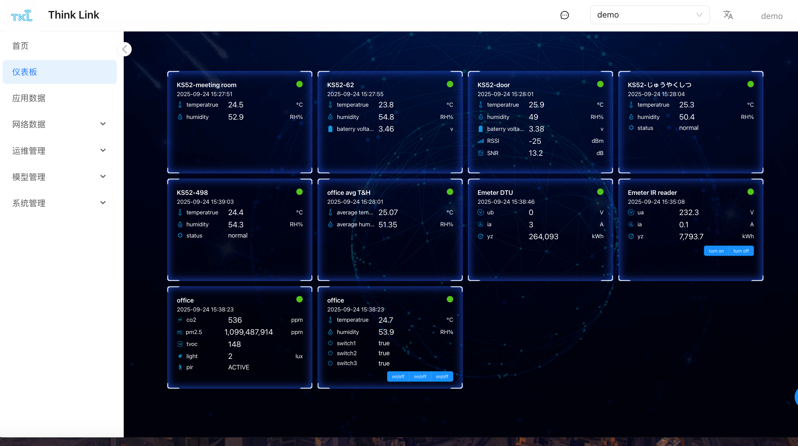

# 1. 仪表板设置
在创建或编辑仪表板时，可通过“配置”面板对整体布局和显示属性进行自定义。主要配置项如下：

+ **名称**：设置仪表板的名称，便于识别和管理。
+ **启用**：勾选后，该仪表板将参与系统轮播显示，可在多个仪表板之间自动切换。
+ **卡片高度**：统一设置仪表板中所有卡片的高度。注意：单个仪表板仅支持一种卡片高度类型。
+ **列数**：定义每行显示的卡片数量，支持灵活布局调整。
+ **容器**：选择卡片的背景风格，提供多种视觉样式以适配不同场景。
+ **边框**：自定义卡片的边框样式，提升界面美观度与可读性。

> 【提示】更改布局配置后，已添加的组件会自动适配新的行列与尺寸规则。
>

<!-- 这是一张图片，ocr 内容为：仪表板配置 预览 配置 预览 全屏 保存 启用 名称 简易 卡片高度 列数 320 4 边框 容器 BORDERBOX10 NONE 23.8 54.8 设备配置 新增 设备 序号 物模型 数据 EMESER IR REACIOR EMETER DTU KS52 6353012AF1093061 TEMPERATRUE,HUMIDITY 2003-00-30 15 3785 1 AEAYCTUN . 25.07 O OVEAGE HUM. 51.35 GS TEMPERATRUE,HUMIDITY,BATERRY VOLTAGE 6353012AF1093062 KS52 2 6353012AF1093063 KS52 TEMPERATRUE,HUMIDITY,BATERRY VOLTAGE,R KS52 3 6353012AF1093064 TEMPERATRUE,HUMIDITY,STATUS 4 6353012AF1090498 KS52 TEMPERATRUE,HUMIDITY,STATUS AVERAGE TEMPERATRUE,AVERAGE HUMIDITY A353012AF1000001 AVERAGE 6353012AF1090468 UB.IA.YZ EMETER -->

## 1.1. 设备卡片配置
通过点击“新增”按钮，可向当前仪表板添加设备数据卡片，实现关键数据的可视化展示。

+ **序号**：设定该数据项在卡片列表中的显示顺序，数值越小，优先级越高，越靠前显示。
+ **物模型**：选择目标设备所属的物模型类别（如温湿度传感器、智能电表等），用于确定数据结构与解析规则。
+ **设备**：在选定物模型下，进一步指定具体的设备实例。
+ **数据**：从所选设备中挑选需要展示的数据字段（如温度、湿度、电量等）。
+ RPC：选择在卡片下方启用的RPC操作

> 【注意】支持添加多个设备卡片，每个卡片独立配置并实时刷新数据。
>

<!-- 这是一张图片，ocr 内容为：添加数据项 序号 设备 请选择 物模型 请选择 数据 请选择 RPC 请选择 取消 确定 -->

## 1.2. 查看仪表板
进入系统左侧菜单的**【仪表板】** 页面，即可查看所有已配置的仪表板。

+ 所有标记为“启用”的仪表板将自动参与轮播播放，适用于大屏监控场景。
+ 点击**全屏** 按钮，可将其以全屏模式展示，方便现场演示或集中监控。

<!-- 这是一张图片，ocr 内容为：THINK LINK TKL DEMO DEMO 首页 仪表板 KS52-MEETING ROOM KS52-62 2025-09-24 15:27:51 2025-09-24  15:28:04 应用数据 C 25.3 TEMPERATRUE  24.5 'C 25.9 TEMPERATRUE  23.8 52.9 RH% 50.4 RH% RH% RH% 54.8 HUMIDITY 网络数据 3.38 BATERRYVOLTA...46 -25 DBM 运维管理 13.2 E SNR 模型管理 EMETER IR READER EMETER DTU KS52-498 OFFICE AVG T&H 2025-09-24 15:28:01 2025-09-24  15:35:08 系统管理 2025-09-24  15:39-03 232.3 UB AVERAGE TEM... 25.07 24.4 0 3 IO 54.3 AVERAGE HUM... 51.35 RH% 0.1 OYZ NORMAL KWH KWH 7,793.7 24 Q 264,093 OFFICE OFFICE 2025-09-24 15:38:23 2025-09-24 15:38:23 24.7 536 PPM 53.9 1,099/487,914 148 TRUE ACTIVE -->

以下是您提供的“物模型”章节内容，经优化后的使用说明书格式。文字描述更为清晰、专业，并保留了原有技术细节与结构逻辑，便于用户理解与查阅。
