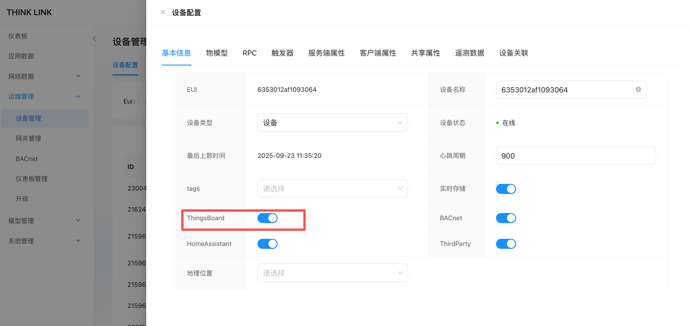
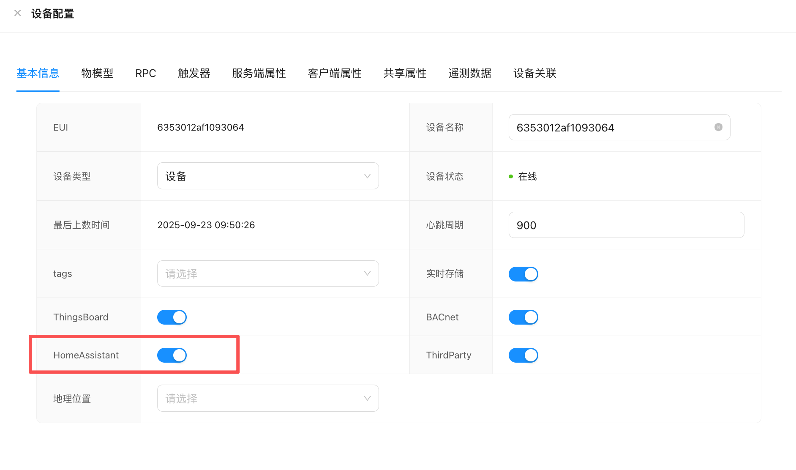
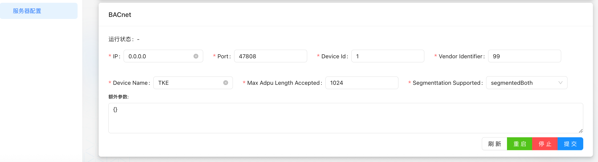

# 1. 服务器配置
## 1.1. ThingsBoard
ThinkLink不提供 ThingsBoard 服务器的搭建服务，但支持与已部署的 ThingsBoard 平台实现无缝数据对接。通过配置相关连接参数，TKL 可将设备数据实时同步至 ThingsBoard，便于用户进行可视化展示与高级应用开发。

### 1.1.1. 获取 ThingsBoard 连接信息
+ **Protocol**：通信协议
+ **Host**：服务器地址
+ **Port**：服务端口
+ **AccessToken**：设备接入令牌

<!-- 这是一张图片，ocr 内容为：设备 设备筛选器 告警 I仪表板 是否网关 客户 状态 标签 公开 名称 设备配置 创建时间 实体 非活动 2025-09-23 11:22:37 THINKLINK DEFAULT [品 设备 翻资产 设备凭据 福实体视图 凭扼类型 L GATEWAYS MQTT BASIC X.509 ACCESS TOKEN 配置 访问令牌 客户 IENPGFZD6J2KNKMVC4G6 规则链库 边缘管理 取消 保存 火高级功能 -->

### 1.1.2. 填写 ThingsBoard信息
> 📌**操作说明**：
>
> 1. 登录 TKL 系统，进入「服务器配置」页面；
> 2. 找到**ThingsBoard 对接配置** 区域；
> 3. 填写上述四项必要信息；
> 4. 点击「提交」保存配置；
> 5. 配置完成后，请点击「重启」按钮以启动或更新 ThingsBoard 服务连接。
>

<!-- 这是一张图片，ocr 内容为：系统管理 THINGS BOARD 用户管理 运行状态: 运行中 角色管理 PROTOCOL: 192.168.1.239 21883 HOST: PORT: ACCESS TOKEN: MQTT 服务器配置 提交 刷新 停止 重启 -->

### 1.1.3. 在设备层面启用 ThingsBoard 功能
仅完成服务器配置尚不足以激活数据同步。您还需在具体设备管理中开启 ThingsBoard 同步功能。

1. 进入 TKL 的「设备管理」模块；
2. 选择需要对接到 ThingsBoard 的设备；
3. 在设备详情页中，找到并启用「ThingsBoard 功能」开关；
4. 保存配置。

✅ 启用后，该设备及其属性、遥测数据、实体信息将自动同步至 ThingsBoard 平台。

<!-- 这是一张图片，ocr 内容为：THINK LINK 设备配置 仪表板 设备管理 RPC 遥测数据 客户端属性 共享属性 触发器 服务端属性 设备关联 物模型 基本信息 应用数据 设备配置 网络数据 设备名称 6353012AF1093064 6353012AF1093064 EUI 运维管理 EUI: 设备管理 设备 在线 设备状态 设备类型 网关管理 心跳周期 900 最后上数时间 2025-09-23 11:35:20 BACNET ID 仪表板管理 请选择 23004 实时存储 TAGS 升级 21624 THINGSBOARD BACNET 模型管理 21596 系统管理 THIRDPARTY HOMEASSISTANT 21596 请选择 地理位置 21596 21596 -->

### 1.1.4. 在 ThingsBoard 上查看设备
当设备成功上行第一条数据时，ThingsBoard 将自动注册该设备（基于提供的 AccessToken），并在其设备列表中显示。注意事项：

+ 确保 `AccessToken` 正确无误，并已在 ThingsBoard 侧预先创建；
+ 若设备未出现，请检查网络连通性、端口开放情况以及 Access Token 是否绑定正确的设备；
+ 数据同步为双向：TKL 负责采集和处理数据，ThingsBoard 负责展示与规则引擎处理。

<!-- 这是一张图片，ocr 内容为：首页 设备 设备筛选器 告警 LI仪表板 是否网关 设备配置 公开 标签 名称 客户 状态 创建时间 实体 活动 6353012AF1093063 2025-09-23 11:30:11 DEFAULT G 设备 2025-09-2311:30:11 SS51A998FB001005 活动 DEFAULT 翻资产 实体视图 活动 6353012AF1093064 2025-09-23 11:29:49 DEFAULT GATEWAYS 2025-09-23  11:22:37 活动 THINKLINK DEFAULT 配置 客户 规则链库 边缘管理 -->

### 1.1.5. 附：如何创建网关的 Access Token
在 ThingsBoard 平台中为网关创建 Access Token 的步骤如下：

1. 登录 ThingsBoard Web 界面；
2. 创建或选择一个“网关”类型的设备；
3. 进入该设备的“凭证”（Credentials）页面；
4. 复制或生成**Access Token**；
5. 将此 Token 填入 TKL 的服务器配置中。

## 1.2. HomeAssistant
HomeAssistant 服务器需由用户自行搭建，不属于 ThinkLink（TKL）系统的功能范围。TKL 提供与 HomeAssistant 的无缝对接能力，实现设备信息、属性及实体的自动发现与同步。

完成相关配置后，点击**提交**按钮，并在提示后点击**重启**，即可启动与 HomeAssistant 的服务连接。

>**【注意】**若希望设备能在 HomeAssistant 中完整显示并正常使用，必须在对应设备的管理配置中开启**HomeAssistant 功能**。启用后，该设备及其属性、实体将在 HomeAssistant 页面中自动被发现并呈现。
>

### 1.2.1. 对接方式
TKL 支持两种 Broker 模式与 HomeAssistant 进行集成：

+ 使用**ThinkLink 的 MQTT Broker** + 使用 **HomeAssistant 的 MQTT Broker**

无论选择哪种方式，请确保满足以下两个前提条件：

> ✅**前提条件 1**  
物模型中已正确配置了 HomeAssistant 相关字段。  
配置方法详见：章节 7.1 
>

> ✅**前提条件 2**在目标设备的配置页面中已启用**HomeAssistant 功能**
>

<!-- 这是一张图片，ocr 内容为：设备配置 共享属性 遥测数据 客户端属性 服务端属性 物模型 设备关联 基本信息 触发器 RPC 设备名称 EUI 6353012AF1093064 6353012AF1093064 设备 在线 设备类型 设备状态 2025-09-23 09:50:26 最后上数时间 900 心跳周期 请选择 实时存储 TAGS THINGSBOARD BACNET THIRDPARTY HOMEASSISTANT 请选择 地理位置 -->

### 1.2.2. 方式一：使用 ThinkLink 的 Broker
在此模式下，用户的 HomeAssistant 服务器作为 MQTT 客户端连接至 ThinkLink 的内置 MQTT Broker。

#### 1.2.2.1. 配置步骤：
1. 登录到您的 HomeAssistant 服务器；
2. 进入**MQTT 集成设置**，添加一个新的 MQTT Broker；
3. 填写 ThinkLink 的 Broker 连接信息，包括：
    - 地址（IP 或域名）
    - 端口
    - 用户名 / 密码
4. 设置以下关键参数：
    - `discovery_prefix`（服务发现前缀）
    - `manufacturer`（厂商名称）
5. 保存配置并重启 HomeAssistant 服务。

完成上述操作后，已启用 HomeAssistant 功能的设备将自动在 HomeAssistant 中被发现并展示为对应实体。

<!-- 这是一张图片，ocr 内容为：HOME ASSISTANT 概览 MQTT 添加MQTT设备 添加条目 地图 铂金 X MQTT 4 能源 集成条目 请输入您的 MQTT 代理的连接信息. 日志 本 LOCALHOST 历史 代理* 192.16 HACS MQTT 代理的主机名或 IP 地址. 媒体 端口* 1883 印 待办事项清单 MQTT 代理侦听的塔口,例如:1883. 用户名 登录您的 MQTT 代理的用户名. 密码 开发者工具 登录您的 MQTT 代理的密码. 设置 提交 -->

<!-- 这是一张图片，ocr 内容为：三HOME ASSISTANT 概览 MQTT 十添加MQTT设备 添加条目 地图 铂金品质 能源 集成条目 三日志 LOCALHOST 历史 HACS 媒体 待办事项清单 开发者工具 设置 -->

<!-- 这是一张图片，ocr 内容为：品 工作台门思科技 在DB-GPT中使用... 订钉宜搭 所有书签 开始| JSON在线编辑器-B... 国家电网新一代电... GIT COMMIT 命令|... NETWORK MANAGEM... 三HOME ASSISTANT 个 MQTT选项 地图 /V32/MTFAC/HA MQTT 集成将订阅的配置主题的前温. 能源 启用出生消息 三日志 设置后,当MQTT准备就缩时,HOME ASSISTANT 将向您的 MQTT代理发布一个在线消 息. 山 历史 /V32/MTFAC/HA/STATUS HACS 保持 HOME ASSISTANT将发布"BIRTH 出生消息的 MQTT 主题, 媒体 出生消总有效载荷 待办事项清单 ONLINE 当MQTT准备就堵并已连接时发布的"BIRTH"出生消总. 出生消息 QOS 当MQTT准备就结并已连接时发布的"HIRTH"出生消息的服务质量 保留出生消息 开发者工具 设置后,HOME ASSISTANT 将保留发布到您的MQTT 代理的"BIRTH"出生消息. 设置 启用遗嘱消息 当设置后,HOME ASSISTANT将在MQTT停止或者与您的代理失去连接时,要求您的代理 开始监听 发布一个"WILL"透嘱消息. 通知 /V32/MTFAC/HA/STATUS ADMIN -->

### 1.2.3. 方式二：使用 HomeAssistant 的 Broker
在此模式下，ThinkLink 将作为客户端主动连接至 HomeAssistant 提供的 MQTT Broker。

### 1.2.4. 验证
完成后，ThinkLink 将通过 MQTT 协议向 HomeAssistant 发布设备信息，实现实体自动注册与状态同步。

✅ **验证是否成功：**  
进入 HomeAssistant 的 “设备与服务” 页面，查看是否有来自 ThinkLink 的新设备出现，并检查其传感器、开关等实体是否正常显示和更新。

<!-- 这是一张图片，ocr 内容为：HOME ASSISTANT 概览 MQTT 地图 添加条目 添加MQTT设备 铂金品质 4个设备12个实体 能源 集成条目 日志 历史 LOCALHOST HACS 6353012AF1093061 MANTHINKT&H.3个实体 媒体 6353012AF1093062 待办事项清单 MANTHINKT&H.3个实体 开发者工具 6353012AF1093063 MANTHINKT&H.3个实体 设置 6353012AF1093064 MANTHINKT&H.3个实体 通知 ADMIN -->

## 1.3. BACnet
>**注意**：BACnet 服务功能仅支持在独立部署的 TKE设备/网关(TKG)上使用，云版本（Cloud Service）暂不提供此功能。
>

ThinkLink（TKL）支持将物模型中的设备数据以标准 BACnet 协议对外暴露，便于与楼宇管理系统（BMS）进行集成。要实现完整的 BACnet 服务功能，需完成以下两个步骤：

1. 在物模型中对相关字段进行 BACnet 属性配置；
2. 在目标设备上启用 BACnet 功能并正确配置服务器参数。

### 1.3.1. BACnet 字段配置
启用 BACnet 服务前，必须在**物模型** 中对需要对外映射的字段配置相应的 BACnet 属性。具体配置方法请参考文档第 7.1

### 1.3.2. 服务器配置
为使 TKL 成功作为 BACnet 服务器运行，需在系统中配置以下核心参数。所有设置均位于**运维管理 → BACnet** 菜单下。

请确保已在**设备管理** 页面为对应设备开启 BACnet 服务，之后在此处完成详细配置，并将生成的 BACnet 点表导出提供给 BMS 平台使用。

| 配置项 | 说明 | 默认值 | 是否可修改 |
| --- | --- | --- | --- |
|**IP 地址** | TKL 所在设备的本地 IP 地址，用于 BACnet 通信   若设为 `0.0.0.0`，表示绑定所有网络接口 | `0.0.0.0` | 是 |
|**Port** | BACnet 服务监听端口 | `47808`（十进制）   （即 UDP 端口 0xBAC0） | 是，可根据 BMS 要求调整 |
|**Device ID** | BACnet 设备唯一标识符，必须在系统内唯一   需与 BMS 平台协商一致 | `1` | 是 |
|**Vendor Identifier** | 厂商标识号，代表设备制造商 | `99`（非官方保留值，建议按实际填写） | 是 |
|**Device Name** | 设备名称，用于在 BMS 中显示 | `TKE` | 是，建议按现场命名规范修改 |
|**Max APDU Length Accepted** | 最大可接受 APDU 长度，影响通信效率和兼容性 | `1024` | 是，根据客户端能力调整 |
|**Segmentation Supported** | 分段支持模式，定义设备是否支持分段传输 | `segmentedBoth`   （发送和接收均可分段） | 是，可选：   `noSegmentation`   `segmentedTransmit`   `segmentedReceive`   `segmentedBoth` |

<!-- 这是一张图片，ocr 内容为：服务器配置 BACNET 运行状态:- 0  IP: DEVICE LD: 0.0.0.0 VENDOR LDENTIFIER: 47808 66 PORT: TKE 1024 *MAX ADPU LENGTH ACCEPTED: *SEGMENTTATION SUPPORTED: DEVICE NAME: SEGMENTEDBOTH 额外参数: 刷新 提交 停止 单启 -->

完成上述配置后，请进入 **点表管理**模块查看或导出当前设备的 BACnet 对象列表（即点表），并交付给 BMS 集成方用于接入和监控。**提示**：

+ 修改配置后需重启 BACnet 服务或相关设备以生效。
+ 建议与 BMS 集成方确认上述参数的具体要求，避免因协议不匹配导致连接失败。
+ BACnet over IP 协议基于 UDP 构建，确保网络层面允许相应端口通行。
