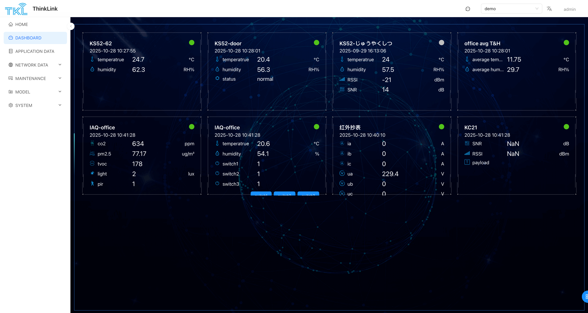

## dashboard Settings 
the Configuration panel enables you to customize the overall layout and display properties when you create or edit a dashboard. The main configuration items are as follows: 

+ **name **: Set the name of the dashboard for easy identification and management. 
+** Enable **: After checking, the dashboard will participate in the system carousel display and can automatically switch between multiple dashboards.
+** Card height **: Set the height of all cards in the dashboard uniformly. Note: A single Dashboard supports only one card height type. 
+** Number of columns **: Define the number of cards displayed per line and support flexible layout adjustment. 
+** Container **: Select the background style of the card and provide a variety of visual styles to adapt to different scenes. 
+** Border **: Customize the border style of the card to improve the aesthetics and readability of the interface. 

> [Tip] After changing the layout configuration, the added components will automatically adapt to the new row, column and size rules. 
>

<!-- 这是一张图片，ocr 内容为：PREVIEW CONFIGURATION FULL SCREEN PREVIEW SAVE NAME 简易 CARD HEIGHT 300 DEVICE CONFIGURATION DATA RPC DEVICE ADD INDEX THING MODEL OPERATION 21 6353012AF1093062 MT-KS52 TEMPERATRUE.HUMIDITY 2 MT-KS52 6353012AF1093063 3 MT-KS52 6353012AF1093064 TEMPERATRUE,HUMIDITY,RSSI,SNR 0 20.5 5 AVERAGE TEMPERATRUE ,AVERAGE HUMIDITY AVERAGETH 8 MT-KS61 CO2,PM2.5,TVOC,LIGHT,PIR MT-KS61 6353012AF1090142 UE,HUMIDITY,SWITCH1,SWITCH2,SWITCH3 TEMPERATRUE. EDIT MT-DTU- S00016500AB52085 10 11 6353012AL1090468 MT-DTU SNR,RSSI ,PAYLOAD -->

## Device Card Configuration 
by clicking the Add button, you can add device data cards to the current dashboard for visual display of key data. 

+** Serial Number **: Set the display order of the data item in the card list. The smaller the value, the higher the priority and the higher the display. 
+** Thing Model **: Select the thing model category (such as temperature and humidity sensor, smart meter, etc.) to which the target device belongs to determine the data structure and parsing rules. 
+** Equipment ** under the selected model, further specify the specific equipment instance. 
+** Data**: Select the data fields to be displayed (such as temperature, humidity, power, etc.) from the selected device. 
+ RPC: Select the RPC operation enabled below the card 

> [Note] Support to add multiple device cards, each card independent configuration and real-time data refresh.
>

<!-- 这是一张图片，ocr 内容为：X ADD DATA LTEM INDEX 12 DEVICE 3F53012B00019F5F(3F53012B00019F5F) THING MODEL MT-DTU(MT_DTU) DATA PLEASE SELECT RPC PLEASE SELECT CANCEL OK -->

## View Dashboard 
enter the left side menu of the system **[instrument panel]** page, you can view all configured dashboards. 

+ All dashboards marked as "enabled" will automatically participate in Carousel playback, which is suitable for large screen monitoring scenarios. 
+ Click **full Screen** button, which can be displayed in full-screen mode for on-site demonstration or centralized monitoring. 

<!-- 这是一张图片，ocr 内容为：THINKLINK TIKL 金 HOME DASHBOARD KS52-DOOR KS52-62 OFFICE AVG T&H 2025-10-28 10:28:01 2025-10-28 10:27:55 目A 2025-10-28 10:28:01 2025-09-29 16:13:06 APPLICATION DATA AVERAGE TEM...11.75 C 20.4 CC 24 24.7 TEMPERATRUE TEMPERATRUE AVERAGE HUM...29.7 56.3 57.5 62.3 HUMIDITY RH% RH% 21 RSSI 14 M SNR DB &SYSTEM 红外抄表 KC21 IAQ-OFFICE IAQ-OFFICE 2025-10-28 10:41:28 2025-10-28 10:41:28 2025-10-28 10:40:10 2025-10-28 10:41:28 20.6 SNR 634 A NAN TEMPERATRUE 0 CO2 54.1 77.17 R IB NAN RSSI HUMIDLITY DBM PM2.5 UG/M PAYLOAD 178 SWITCH1 229.4 2 LUX EN SWITCH2 IGHT 1 SWITCH3 PIR UB 0 LIC -->

The following is the content of the "thing model" chapter you provided, and the optimized instruction manual format. The text description is more clear and professional, and retains the original technical details and structural logic, which is convenient for users to understand and consult. 
