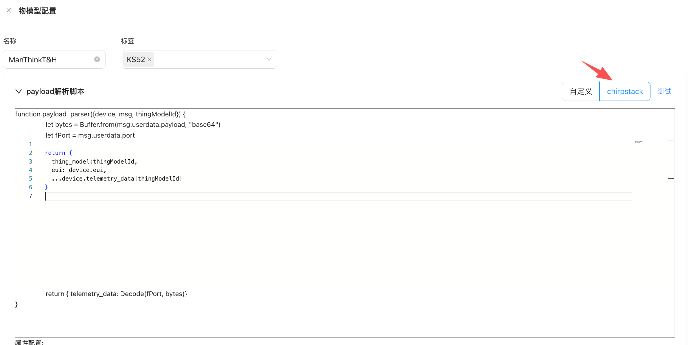
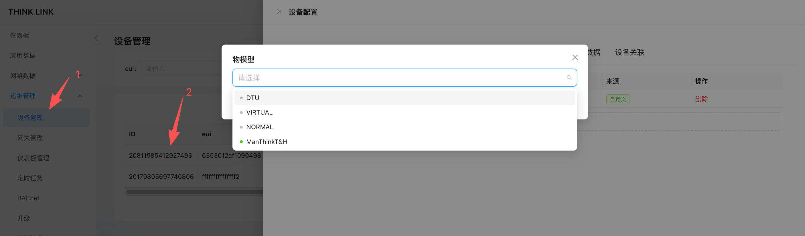

# 1. Thing Model
the Thing Model is the core module in the ThinkLink platform that defines device functionality and data structures. Through the thing model, raw data from the LoRaWAN network server (NS) or other Protocol access can be parsed into standardized application layer data (such as telemetry data, attribute information), and support visual display in tables, charts, or dashboards. 

## 1.1. Create a thing model
when creating a new object model, you need to enter **unique Name** as identification. This name cannot be repeated throughout the system. It is recommended to name it according to the type or function of the device (for example: temperature and humidity sensor_Model A). 

After the creation is completed, you can configure the parsing script to decode and map the upstream data. 

<!-- 这是一张图片，ocr 内容为：物模型配置 标签 名称 MANTHINKT&H KS52X 自定义 测试 CHIRPSTACK PAYLOAD解析脚本 FUNCTION PAYLOAD_PARSER((DEVICE,MSG,THINGMODELLD))( LET BYTES-BUFFER.FROM(MSG.USERDATA.PAYLOAD,"BASE64") LET FPORT MSG.USERDATA.PORT RETURN THING_MODEL:THINGMODELID, EUI: DEVICE.EUI, DEVICE.TELEMETRY_DATA [THINGMODELID] RETURN ( TELEMETRY_DATA:DECODE(FPORT,BYTES)) 属性配置: -->


## 1.2. Parse Script Description
The role of the parsing script is to convert the raw data sent to ThinkLink by the external platform into a structured **telemetry data (telemetry_data)** and **shared Properties (shared_attrs)** for subsequent application processing and display. 

### 1.2.1. Input parameters
when the script is executed, the system automatically passes in the following parameters: 

| parameter Name  | type  | description  |
| --- | --- | --- |
| `device ` | Object  | the device object to which the message belongs, which contains all the attributes and historical data of the current device.  |
| `msg ` | Object  | the packet origin from the LoRaWAN Application Server (AS). For MQTT access, the message body is in JSON format.  |
| `thingModelId ` | String  | the unique ID of the current object model, which is used to obtain the historical telemetry data of the corresponding object model of the device.  |
| `noticeAttrs ` | Object  | identifies which attributes change and trigger notification events for conditional determination.  |


> **Prompt**: If you already have a parsing script written based on ChirpStack, you can directly select **ChirpStack compatibility mode**. ThinkLink has completed the interface adaptation and can run seamlessly by copying the original code. 
>

### 1.2.2. Telemetry Model Reference Code
Below is a typical parsing script example for a LoRaWAN temperature and humidity sensor, applicable to binary payloads with port number 11 and a fixed length of 15 bytes. Configuration parameters (such as COV threshold, interval, etc.) are sent via port 214 and also returned through port 214. The device model parses these configuration parameters into shared attributes.

```javascript
let    payload = Buffer.from(msg?.userdata?.payload, "base64");
    let    port=msg?.userdata?.port || null;
    function parseSharedAttrs(payload) {
        if (port!=214||payload[0]!=0x2F) { return null}
        let shared_attrs = {};
        if (payload.length<5) { return null}
        shared_attrs.content = payload.toString('hex');
        let size=payload.length-4
        let regAddress=payload[2]
        for (let i=0; i<size; i++) {
            regAddress=payload[2]+i
            switch (regAddress) {
                case  58:
                    if  ( size<(2+i) ) { break }
                    shared_attrs.period_data = payload.readUInt16LE(4+i)
                    break;
                case 142:
                    if  ( size<(2+i) ) { break }
                    shared_attrs.period_measure = payload.readUInt16LE(4+i)
                    break;
                case 144:
                    if  ( size<(1+i) ) { break }
                    shared_attrs.cov_temperatrue = payload.readUInt8(4+i)*0.1
                    break;
                case 145:
                    if  ( size<(1+i) ) { break }
                    shared_attrs.cov_humidity = payload.readUInt8(4+i)*0.1
                    break;
                default: break
            }
        }
        if (Object.keys(shared_attrs).length == 0) {
            return null
        }
        return shared_attrs;
    }
    function parseTelemetry(payload){
        if (port!=11||payload[0]!=0x21||payload[1]!=0x07||payload[2]!=0x03||payload.length !=15){
            return null
        }
        let telemetry_data = {};
        telemetry_data.period_data =payload.readUInt16LE(5)
        telemetry_data.status ="normal"
        if ((payload[7]&0x01)!=0){  telemetry_data.status ="fault" }
        telemetry_data.temperatrue=Number(((payload.readUInt16LE(8)-1000)/10.00).toFixed(2))
        telemetry_data.humidity=Number((payload.readUInt16LE(10)/10.0).toFixed(2))
        let vbat=payload.readUInt8(12)
        telemetry_data.vbat=Number(((vbat*1.6)/254 +2.0).toFixed(2))
        telemetry_data.rssi=msg.gwrx[0].rssi
        telemetry_data.snr=msg.gwrx[0].lsnr
        return telemetry_data
    }
    let tdata=parseTelemetry(payload)
    let sdata=parseSharedAttrs(payload)
    if (tdata?.period_data!=null){
        if (sdata===null) {sdata={}}
        sdata.period_data = tdata.period_data
    }
    return {
            telemetry_data: tdata,
            server_attrs: null,
            shared_attrs: sdata
    }
```

### 1.2.3. Detailed explanation of key parameters
#### 1.2.3.1. `device `-Device Object
represents the device instance that received the message, including all its known states and properties: 

+ `device.telemetry_data[thingModelId] `: Gets the latest package of telemetry data for the specified object model under the device. 
+ Support for multi-object model query: If the device is mounted with multiple telemetry models, you can use different `thingModelId `access the respective historical data separately. 

#### 1.2.3.2. `msg `-Raw message data
the standard data format of the LoRaWAN AS interface received by ThinkLink is AS follows: 

```json
{
  "if": "loraWAN",
  "gwrx": [
    {
      "eui": "5a53012501030011",
      "chan": 0,
      "lsnr": 13.2,
      "rfch": 1,
      "rssi": -92,
      "time": "2025-09-17T03:51:04.8516751Z",
      "tmms": 0,
      "tmst": 2845948222,
      "ftime": 0
    }
  ],
  "type": "data",
  "token": 14892,
  "moteTx": {
    "codr": "4/5",
    "datr": "SF7BW125",
    "freq": 471.5,
    "modu": "LORA",
    "macAck": "",
    "macCmd": ""
  },
  "geoInfo": {
    "type": "gw:wifi",
    "accuracy": 50,
    "altitude": 0,
    "latitude": 34.19925,
    "longitude": 108.8659
  },
  "moteeui": "6353012af1090498",
  "version": "3.0",
  "userdata": {
    "port": 11,
    "class": "ClassA",
    "seqno": 18654,
    "payload": "IQcDDG4PAADWBIsC34IG",
    "confirmed": false
  }
}
```

common field extraction methods: 

+ load data:`msg.userdata.payload `(Base64 encoding) 
+ port number: `msg.userdata.port `
+ signal strength (RSSI): `msg.gwrx[0].rssi `
+ signal to noise ratio (SNR): `msg.gwrx[0].lsnr `
+ timestamp: `msg.gwrx[0].time `

for non-LoRaWAN data sources (such as JSON data reported by MQTT), you can directly access the corresponding fields at the JSON level. 

#### 1.2.3.3. `thingModelId `-Thing Model Identifier
used to access the historical data of the device-associated specific object model. For example: 

```javascript
let lastData = device.telemetry_data['temp_humi_v1'];
```

#### 1.2.3.4. `noticeAttrs `-Change notification sign
this object indicates whether this message is triggered by some property change: 

| field  | type  | description  |
| --- | --- | --- |
| `server_attrs ` | Boolean  | if `true `, indicating that the server attribute has changed |
| `shared_attrs ` | Boolean  | if `true `, indicates that the shared attribute has changed  |
| `telemetry_data ` | Boolean  | if `true `, indicating telemetry data updates  |


can be used to control whether specific logic needs to be performed (such as writing to the database only on telemetry updates). 

#### 1.2.3.5. Return value format
the parsing script must return a  structure that conforms to the following specifications: 

```javascript
return {
    sub_device:null,
    telemetry_data: {   
        temperature: 23.5,
        humidity: 60.2,
        rssi: -85
    },
    server_attrs: null,
    shared_attrs: {      
        heartbeat_interval: 30
    }
};
```

#### 1.2.3.6. Response Field Definitions
| Field Name | Default | Description |
| --- | --- | --- |
| shared_attrs | null | Shared attributes — persistent data stored at the device level, which can be invoked by other modules within the system (e.g., automation rules, alarm evaluations). |
| sub_device | null | Sub-device identifier. If the parent device (such as a DTU) collects data from sub-devices via RS-485 or M-Bus, this field should contain the communication address of the sub-device (e.g., its 485 address). Based on this, ThinkLink will virtually generate a sub-device in the device management system and automatically assign it a unique EUI. |
| telemetry_data | null | Telemetry data — used to report real-time operational data and application-layer parsed results. Commonly used in dashboards, trend charts, and historical data queries. |
| server_attrs | null | Server-side attributes — metadata or configuration information that does not need to be stored locally on the device. Stored only on the ThinkLink server side, suitable for advanced feature extensions. |


✅ **Additional Notes:**

+ Although all fields are marked as "No" (not required), properly populating them according to business requirements is essential for achieving full system functionality.
+ Data types must comply with key-value format. Use valid strings, numbers, booleans, or objects as appropriate.

## 1.3. Show Fields
through the "Display field" configuration, you can define the specific data items presented in the application layer data presentation interface (such as tables, cards, dashboards, etc.). 

+ **Telemetry Field**: must be reported from the device `telemetry`Select from the data item, and the field names must be exactly the same. 
+ **Serial Number** used to control the order in which the field appears in the table or card view. 
+ **Alias**: The name of the field displayed in the front-end interface to improve readability. 
+ **Unit**: The unit corresponding to the value of this field (for example, &deg; C,%, m³, etc.). 
+ **Type**: Select according to the actual data type. It is recommended to select numeric data. `number `type to support formatted display. 
+ **Icons**: Optional icon for visual display. Support SVG format, recommended from [ali icon vector library ](https://www.iconfont.cn/)download and embed the SVG code. 

> **Prompt**: After the display fields are correctly configured, the system will automatically extract the corresponding fields from the parsed data of the TMS and perform visual rendering on the application side. 
>

<!-- 这是一张图片，ocr 内容为：展示字段 字段标识 序号 别名 类型 单位 操作 新增 图标 CO, 编辑删除 CO2 CO2 NUMBER PPM 编辑删除 5 STRING PIR PIR 黑 编辑删除 1 HUMIDITY RH% HUMI NUMBER 贝淇 编辑删除 5 NUMBER PM2.5 PPM PM25 C 编辑删除 0 TEMPERATRUE TEMP NUMBER 编辑删除 TVOC TVOC NUMBER 编辑删除 LIGHT 3 LIGHT LUX NUMBER U 编辑删除 6 BOOLEAN RELAY1 SWITCH1 7 编辑删除 SWITCH2 BOOLEAN RELAY2 编辑删除 RELAY3 BOOLEAN SWITCH3 -->


## 1.4. BACnet field configuration
in the ThinkLink(TKL) system, when providing device data through the BACnet protocol, you need to map and configure the relevant data fields. The following is the description of each parameter when adding the BACnet field: 

+ **field_name**  
The field identifier of the data item, which must be consistent with the field identifier defined in the object model, is used to implement the mapping between the object model data and the BACnet object properties. 
+ **object_name_suffix**  
the name suffix. The TKL system will use the device's EUI address to concatenate with this suffix to generate a unique `object_name `to ensure the uniqueness of each BACnet object in the network. 
+ **object_type**  
select the type of the BACnet object corresponding to the data item, such as Analog Input (Analog Input), Binary Output (Binary Output), etc., based on the nature of the actual data. 
+ **unit**  
configure the unit of measurement for this data item to ensure that the physical meaning is correctly displayed in the BACnet client (such as BAS or YABE). 
+ **cov_increment**  
Change of Value trigger Upload threshold (Change of Value Increment). When the data Change amplitude exceeds this set Value, the system will actively send COV(Change of Value) notification, which is suitable for scenarios that support the COV function. 
+ **default_value**  
the initial value of the data item. Before the device reports the data, the system uses the default value to display and respond. 
+ **RPC**  
Associates the remote control function corresponding to this field. If you want to write to this field or issue instructions, you must configure it in the RPC model in advance before you can select the corresponding RPC function here. 

<!-- 这是一张图片，ocr 内容为：BACNET字段 OBJECT_NAME后缀 字段标识 请输入 请输入 OBJECT_TYPE UNIT ANALOGVALUE NOUNITS 默认值 COV_INCREMENT O 0 RPC 请选择 确定 取消 -->


### 1.4.1. Use YABE to view BACnet data
YABE(Yet Another BACnet Explorer) is a commonly used BACnet device debugging and browsing tool. After the configuration is complete, you can connect to the TKL system through YABE to discover and view the published BACnet devices and their object attributes, and verify whether the data is published normally. 

<!-- 这是一张图片，ocr 内容为：YET ANOTHER BACNET EXPLORER -YABE FILE FUNCTIONS HELP OPTIONS SUBSCRIPTIONS,PERIODIC  FOLLING EVENTS/ALARNS DEVICES STATUS OBJECTID TIME VALUE SHOW DEVICE DES CR.. ANA UDP:47808 COV INCREMENT OBJECT ANALOG VALUE [TKE [1] OBJECT LDENTIFIER 6353012AF1003061H OBJECT NAME 2:OBJECT ANALOG VALUE OBJECT TYPE 62.3 PRESENT VALUE 95:NO UNITS UNITS 0 OBJEETS:9ITENS PAUSE PLOTTER & TKE(DEVICE:1) )COV O POLL (MS)1000 CLEAR PLOTTER EXPORT SETUP 网 6353012AF1093061-H (AV:1) 0950012018008811411415 1.2 各团习习习司 6353012AF1093062-H(AV:3) 6353012AF1093062-T (AV:4) 6353012AF1093063-H (AV:5) 1.0 6353012AF1093063-T (AV:6) 6353012AF1093064-H (AV:7) 6353012AF1093064-T (AV:8) 0.8 0.6 0.4 0.2 COY HCREMENT 0.0- BACNET_APPLICATION_TAG_REAL 12:00 06:00 00:00 00:00 18:00 Log SENDING READPROPERTYLFULTIPLEREQUEST... COMPLEXACK SENDING READPROPERTYTUL TIPLEREQUEST COMPLEXACK............................ SENDING READPROPERTYLFUL TIPL REQUEST. COMPLEXAEK -->


### 1.4.2. Generate a BACnet point table
if the user's BMS (Building Management System) needs to be formally deployed, a standard BACnet point table file is usually required to facilitate system integration and debugging. 

1. Enter **operation and maintenance management → BACnet** module. 
2. Click **incremental generation** button. 
3. Select the target in the pop-up window **object Model**. 
4. After confirmation, the system will automatically generate the point table information of all BACnet fields under the corresponding model. 

The generated point table contains key information such as object type, object instance number, object name, attribute description, data type, company, read and write permissions, and can be delivered to third-party systems for docking. 

<!-- 这是一张图片，ocr 内容为：TKL THINKLINK DEMO HOME BACNET DASHBOARD INCREMENTAL GENERATION QUERY OBJECT_TYPE: EXPAND THING MODEL APPLICATION DATA .MT-KS52(MT_KS52) NETWORK DATA 中工 & EXPORT IST . IMPORT OK CANCEL MAINTENANCE ID OPERATION OBJECT_TYPE OBJECT_NAME DESCRIPTION OBJECT ID UNITS &DEVICE 品 GATEWAY BACNET NO DATA 昭DASHBOARD UPGRADE -->


<!-- 这是一张图片，ocr 内容为：THINK LINK 大门测试有限公司 THE DOOR TIKI 首页 BACNET 仪表板 重置 请选择 OBJECT_ID: 查询 展开 请输入 OBJECT_TYPE: 应用数据 网络数据 飞导出 +新增 重排OBJECT ID 增量生成 导入 应用点表 运维管理 1D 操作 OBJECT ID DESCRIPTION OBJECT TYPE UNIT OBJECT NAME 设备管理 网关管理 6353012AF1093064-T 编辑 8 23010968485236745 ANALOGVALUE BACNET 7 编辑 6353012AF1093064-H 23010968485236741 ANALOGVALUE 仪表板管理 升级 编辑 6353012AF1093063-T 6 23010968485236746 ANALOGVALUE 模型管理 5 6353012AF1093063-H 编辑 23010968485236742 ANALOGVALUE 系统管理 4 编辑 23010968485236748 6353012AF1093062-T ANALOGVALUE 绵辑 6353012AF1093062-H 23010968485236744 ANALOGVALUE 编辑 23010968485236747 6353012AF1093061-T ANALOGVALUE -->


## 1.5. Home Assistant integrated configuration
- **[Note 1] Function enabling requirements** :the Home Assistant function must be manually enabled on the device configuration page to be automatically discovered and integrated by the Home Assistant. When this feature is not turned on, the device does not send any discovery messages to Home Assistant.
- **[Note 2] Configuration Effective Mode** :after modifying the field configuration of Home Assistant, you need to go to TKL's **server Configuration Page**, click **"Re-register all devices"** button, the updated field configuration will take effect and trigger the re-release of device information to Home Assistant. 

### 1.5.1. Add Home Assistant field
<!-- 这是一张图片，ocr 内容为：物模型配置 展示字段 HA配置 字段标识 新增 序号 操作 别名 FIELD_NAME H 1 编辑删除 温度 T 0 编辑删除 UNIT_OF_MEASUREMEL COMPONENT 编辑删除 4 SNR C SENSOR 3 编辑删除 RSSI 自定义配置 O 编辑删除 VBAT 编辑删除 STATUS BACNET字段配置 新增 操作 FIELD_NAME OBJECT_NA RPCS RPC指令配置预览 RPC 配置预览 ?心跳周期 HOMEASSISTANT字段配置 "COMMAND-TEMPLATE":"IDN""I"20932439878668293)"IDNAMEL":"""""""" 新增 FIELD NAME 别名 操作 ""PERIODL"-I"H VALUE ]")", COMMAND_TOPIC"{RPC TOPIC 子 取消 确定 确定 取消 -->


| field Name  | description  |
| :--- | :--- |
| `field_name ` | the field identifier, which must be consistent with the identifier defined in the Tise model for data matching and mapping.  |
| `name ` | name of the field displayed on the Home Assistant interface.  |
| `component` | Specifies the component types supported in Home Assistant. Currently, TKL only supports native `sensor `type.  |
| `unit_of_measurement ` | the unit of measurement for the value of this field (E. G., &deg; C,%, Pa, etc.).  |


### 1.5.2. Supported device types
currently, ThinkLink only natively supports devices **sensor**(Sensor) type access Home Assistant . 

For other types of devices (such as switch, light, binary_sensor, and so on), you need to define them in the custom configuration of Home Assistant. For details, see The MQTT Discovery guide in the official documentation of Home Assistant: [https://www.home-assistant.io/integrations/mqtt/#mqtt-discovery ](https://www.home-assistant.io/integrations/mqtt/#mqtt-discovery)[1]. 

By following the MQTT Discovery protocol, you can create other types of entities manually or automatically through the platform. 

<!-- 这是一张图片，ocr 内容为：HOME ASSISTANT GETTING STARTED NEED HELP? BIOG INTEGRATIONS DOCUMENTATION 2025.9.4 HOME* INTEGRATIONS * ON THIS PAGE MQTT MQTT CONFIGURATION SETTING UP A BROKER BROKER CONFIGURATION MOTT (AKA MQ TELEMETRY TRANSPORT) ISA MACHINE-TO-MACHINE OR "LNTERNET OF THINGS" ADVANCED BROKER CONFIGURATION ADD INTEGRATION TO MY6 CONNECTIVITY PROTOCOL ON TOP OF TCP/IP.IT ALLOWS EXTREMELY LIGHTWEIGHT PUBLISH/SUBSCRIBE CHANGE MOTT DISCOVERY OPTIONS THE MOTT INTEGRATION WAS INTRODUCED IN HOME MESSAGING TRANSPORT. DISCOVERY OPTIONS ASSISTANT PRE 0.7,AND IT'SED BY 46.8% OF THE BIRTH AND LAST WILL MESSAGES ACTIVE INSTALLATIONS. TESTING YOUR SETUP 里 ITS LOT CLASS IS LOCAL PUSH. CONFIGURATION SHARING OF DEVICE CONFIGURATION PLATINUM QUALITY NAMING OF MOTT ENTITIES MOTT DISCOVERY TO ADD THE MOTT INTEGRATION TO YOUR HOME ASSISTANT INSTANCE,USE THIS MY BUTTON: VIEW SOURCE ON GITHUB DISCOVERY MESSAGES VIEW KNOWN ISSUES DISCOVERY MESSAGES AND AVAILAB ADD INTEGRATION TO MY& USING AVAILABILITY TOPICS DISCOVERY EXAMPLES WITH INTEGRATION OWNERS COMPONENT DISCOVERY MANUAL CONFIGURATION STEPS SUPPORT BY THIRD-PARTY TOOLS WE ARE INCREDIBLY GRATEFUL TO THE FOLLOWING MANUAL CONFIQURED MOTT ITEMS CONTRIBUTORS WHO CURRENTLY MAINTAIN THIS YAML CONFIGURATION LISTED PER ITE INTEGRATION: MOTT DEVICES AND ENTITIES CAN BE SET UP THROUGH MOTT -DISCOVERY OR ADDED MANUALY VIA YAML OR SUBENTR YAML CONFIGURATION KEYED AND BUNDLED BY [DOMAIN] @EMONTNEMERY ENTITY STATE UPDATES CONFIGURATION OF MOTT COMPONENTS VIA MOTT DISCOVERY THE LAST REPORTED STATE ATTRIBUTE @JBOUWH USING TEMPLATES ALARM CONTROLPANEL BINARY SENSOR PUBLISH&DUMP ACTIONS @BDRACO ACTION MQTT.PUBLISH BUTTON ACTION MGTT.DUMP CAMERA LOGGING EVENT EVENT.MGTT.RELOADED COVER 4 CATEGORIES REMOVING THE INTEGRATION CLIMATE(HVAC) -->


### 1.5.3. View devices on Home Assistant
when the configuration is complete, in your Home Assistant instance: 

1. ensure it is added and configured **MQTT integration** and connect to the MQTT Broker used by TKL. 
2. TKL will use the MQTT topic (the default is `homeassistant/ `prefix) automatically sends a device Discovery message . 
3. Enter **settings&gt; Devices and Services&gt; MQTT"** page, you can see the devices and sensors automatically discovered and registered by TKL. 

After that, these devices will appear in your main interface, and can monitor, alarm, linkage and other operations. 

<!-- 这是一张图片，ocr 内容为：三 HOME ASSISTANT 概览 MQTT 地图 添加MQTT设备 添加条目 铂金品质口 4个设备12个实体 能源 集成条目 日志 LOCALHOST 历史 HACS 6353012AF1093061 MANTHINKT8H3个实体 媒体 6353012AF1093062 自 待办事项清单 MANTHINKT&H`3个实体 6353012AF1093063 MANTHINKT&H.3个实体 6353012AF1093064 MANTHINKT&3个实体 开发者工具 设置 -->


## 1.6. Related object model
1. navigate **operation and maintenance management → Equipment Management** to find the target device in the device list. 
2. Click the "Details" button of the device to enter the device details page. 
3. Switch **object Model** tab, click the Add button. 
4. In the pop-up list, select the created object model. After confirmation, the object model can be associated with the device. 

>**Attention**: To associate the same object model for multiple devices in batches, it is recommended to use the template function for efficient operation to improve configuration efficiency. 
>

<!-- 这是一张图片，ocr 内容为：THINK LINK 设备配置 仪表板 设备管理 设备关联 应用数据 物模型 请输入 EUI: 网络数据 请选择 操作 来源 运组管理 DTU 甜除 自定义 VIRTUAL 设备管理 NORMAL EUI 网关管理 MANTHINKT&H 20811585412927493 6353012AF1090498 仪表板管理 20179805697740806 FFFFFFFFFFFFFFF2 定时任务 BACNET 升级 -->


### 1.6.1. View application data
1. enter the left menu bar **application Data** page.
2. Select the corresponding TSS model at the top of the page, and the system will automatically load all device data bound to the TSS model. 
3. When the device has uplink data, the system parses it through the TSL model. You can view the parsed application layer data here. 
4. Click **historical data**, you can switch to the historical data view.**Graph** and **data table** view the data change trend and details in the specified time period in two formats. 

<!-- 这是一张图片，ocr 内容为：THINK LINK DEMO TKI DEMO 首页 应用数据 仪表板 EUI: 请输入 物模型: 重置 展开 KS52 查询 应用数据 网络数据 名称 序号  EUI 更新时间 TEMPERA 操作 TAGS 运维管理 2025-09-24 模型管理 历史数据 24.8 6353012AF1093061 KS52-MEETING ROOM KS52 15:57:52 系统管理 2025-09-24 6353012AF1093063 历史数据 25.7 KS52 KS52-DOOR 15:58:02 2025-09-24 KS52 历史数据 25.6 6353012AF1093064 15:58:04 -->


### 1.6.2. Viewing data through device properties
+ after the device reports the shared attribute data: 
    - enter **operation and maintenance management → Equipment Management** select the target device and click Details ". 
    - Switch **shared Properties** tab to view the current property value and its latest update time in real time. 
+ When the device reports telemetry data: 
    - also go to the "Details" page of the target device. 
    - Switch **telemetry Data** tab, the system will display the latest updated telemetry information, so that you can quickly grasp the operating status of the equipment. 

<!-- 这是一张图片，ocr 内容为：THINK LIR 设备配置 TKL 首页 共享属性 设备关联 遥测数据 服务端属性 基本信息 触发器 物模型 RPC 仪表板 应用数据 KS61(23103614448832517) 网络数据 操作 KEY VALUE 运维管理 509 删除 CO2 设备管理 删除 SILENT PIR 网关管理 删除 54.1 HUMI BACNET 删除 1099049075 PM25 仪表板管理 24.7 删除 TEMP 删除 68 TVOC 升级 2 删除 LIGHT 模型管理 删除 TRUE RELAY1 系统管理 删除 RELAY2 TRUE 删除 RELAY3 TRUE 删除 2025-09-24 15:57:54 UPDATE TIME 取消 确定 -->

