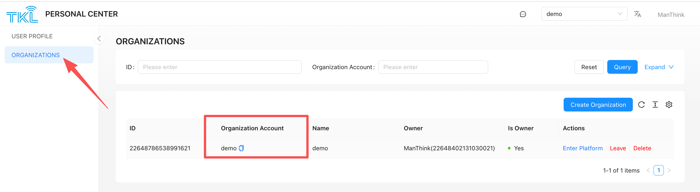

# 1. Product Overview
ThinkLink is a full-stack IoT platform that integrates a LoRaWAN Network Server (NS) and provides the following capabilities:

+ LoRaWAN device and gateway management
+ Multi-protocol access (MQTT/BACnet/Modbus TCP, etc.)
+ Cloud/edge computing deployment (supports cloud servers/TKE edge computing/embedded gateways)
+ End-to-end data lifecycle management

## 1.1. Core Functions
### 1.1.1. Data Management
| Function Module | Capability Description |
| --- | --- |
| **Thing Model** | Parses raw data (from LoRaWAN/third-party sources) into structured data, supporting table and dashboard visualizations. |
| **Asset Management** | Aggregates and analyzes data across multiple devices, supporting multi-dimensional data modeling. |
| **EB Cloud Compilation** | Compiles EB code and facilitates firmware downloads in the cloud. |


### 1.1.2. Device Control
+ **RPC Model**: Enables remote parameter configuration and command issuance.
+ **Linkage Engine**: Facilitates automation rules between devices.

### 1.1.3. Monitoring and Alarms
+ Multi-level alarm threshold settings
+ Notification channels such as email and SMS
+ Real-time alarm dashboard

## 1.2. Protocol Connection Guide
#### 1.2.1. Access Methods
| Method | Data Flow | Applicable Scenarios |
| --- | --- | --- |
| **AS Interface** | Raw data uplink/downlink | Direct operation of the LoRaWAN NS layer  |
| **Thing Model Interface** | Uplink of parsed data  | Application-layer data processing. |


### 1.2.1. Connection Configuration
#### 1.2.1.1. Organization Account Information
`Personal Center > Organization List`

<!-- 这是一张图片，ocr 内容为：TIKL 刘 PERSONAL CENTER DEMO MANTHINK USER PROFILE ORGANIZATIONS ORGANIZATIONS ID: EXPAND PLEASE ENTER ORGANIZATION ACCOUNT: QUARY RESET PLEASE ENTER CREATE ORGANIZATION ID OWNER NAME IS OWNER ORGANIZATION ACCOUNT ACTIONS MANTHINK(22648402131030021) ENTER PLATFORM 22648786538991621 DEMO D YES DELETE DEMO LEAVE 1 1-1 OF 1 ITEMS -->


#### 1.2.1.2. MQTT Credentials
`System Management > Server Configuration > Internal MQTT`

+ **Broker Address**: `thinklink.manthink.cn:1883` (For TKE or independent deployments, please contact the deployment engineer.)
+ **Password**: Set when the organization is created.

<!-- 这是一张图片，ocr 内容为：TIKL 刘 THINKLINK DEMO MANTHINK HOME SERVER CONFIG DASHBOARD INTERNAL MQTT APPLICATION DATA ACCOUNT: DEMO PASSWORD: NETWORK DATA  VIEW ACL PERMISSION SUBMIT REFRESH MAINTENANCE B MODEL THINGS BOARD SYSTEM RUNNING STATUS: R USER PORT: HOST PORT HOST: PLEASE ENTER ACCESS TOKEN: PROTOCOL: PROTOCOL ROLE STOP REFRESH RESTART SUBMIT 品 SERVER CONFIG HOMEASSISTANT -->


### 1.2.2. Communication Topics
There are two methods for protocol connection with ThinkLink. The first is to connect with the AS protocol interface, which allows you to obtain the uplink data from the LoRaWAN NS and send data to the device through the downlink interface.

The second method is to obtain the data parsed by ThinkLink's thing model. With the second method, you can only get the parsed data. Downlink data needs to be sent through the AS protocol interface, or the downlink interface of the AS protocol can be encapsulated into an RPC and called to send data downlink.

#### 1.2.2.1. AS Interface
+ **Uplink Subscription**: `/v32/{Organization Account}/as/up/data/{deveui}`
+ **Downlink Publishing**: `/v32/{tenant}/as/dn/data/{deveui}`

#### 1.2.2.2. Telemetry Data Interface
+ **Uplink Subscription**: `/v32/{Organization Account}/tkl/up/telemetry/{deveui}`
+ DownLink Subscription:/v32/{Organization Account}/tkl/dn/rpc/{eui}


> Replace `{Organization Account}` with your own organization account, which can be found in the corresponding organization in the Personal Center.
>
> `{deveui}` is the unique identifier of the device. For uplink subscriptions, you can use the wildcard `#` as a substitute. When sending downlink data, you must fill in the exact `devEui`.
>

## 1.3. Data Format Specification
ThinkLink (referred to as TKL) supports two methods for data interaction between third-party platforms and the system:

1. **AS Protocol** – to retrieve raw uplink data from devices;
2. **Thing Model Data Interface** – to subscribe to parsed application-layer data, enabling higher-level data integration and business processing.

Users can select the appropriate data access mode based on actual requirements.

### 1.3.1. AS Protocol Integration
The AS protocol is suitable for scenarios requiring direct access to the original payload of LoRaWAN devices. It leverages the MQTT publish/subscribe mechanism to achieve efficient communication.

**AS Protocol Reference**:<a class="action-button primary" href="/zh/Protocol/ASProtocol">AS Protocol</a>


+ **Uplink Data Subscription Topic**  
`/v32/{Organization Account}/as/up/data/#`Third-party platforms can subscribe to this wildcard topic to receive raw uplink data from all devices under a specified tenant.
+ **Downlink Command Publishing Topic**  
  `/v32/{Organization Account}/as/dn/data/{devEui}`When sending downlink commands to a specific device:
    - Replace `{Organization Account}` with the actual organization account (e.g., "demo");
    - Replace `{devEui}` with the target device’s unique identifier (DevEui).

> **Note**: This protocol is ideal for applications that have custom logic for parsing raw data, allowing independent decoding and processing in external systems.
>

### 1.3.2. Thing Model Data Interface
Through the thing model interface, ThinkLink automatically parses raw data according to predefined thing model configurations, delivering structured application-layer data—significantly simplifying integration with upper-layer systems.

+ **Telemetry Data (Uplink)**: Sensor readings or monitoring values reported periodically or triggered by events. Real-time retrieval requires subscription to the corresponding MQTT topic.
+ **Device Control (Downlink)**: Remote operations and parameter configuration are achieved by invoking RPC methods associated with the device.

🔹 **Supported Generic LoRaWAN Downlink RPC**: `[MT ACT] down data`, method = `mt_act_dn_data`

#### 1.3.2.1. Telemetry Data
Telemetry data refers to sensor readings or other monitored values periodically or event-triggered by devices.

**Subscription Topic**  
`/v32/{Organization Account}/tkl/up/telemetry/{eui}`

| Parameter | Description |
| --- | --- |
| `{Organization Account}` | Organization account (e.g., demo) |
| `{eui}` | Device's unique EUI identifier |


**Data Format Example**

```json
{
  "eui": "a00000000000001",
  "thingModelId": "1",
  "thingModelIdName": "SE73",
  "telemetry_data": {
    "temp": 1.0,
    "hum": 2
  }
}
```

📌 **Field Description**:

+ `thingModelId` and `thingModelIdName`: Represent the associated thing model; can be found in the [Thing Model List];
+ `telemetry_data`: Carries the actual sensor data; internal field structure is defined by the thing model—refer to the corresponding thing model configuration.

---

#### 1.3.2.2. RPC Control (Remote Procedure Call)
Users can send JSON-RPC 2.0 formatted messages via MQTT to perform remote control and parameter configuration on devices.

**Downlink Topic**  
`/v32/{Organization Account}/tkl/dn/rpc/{eui}`

| Parameter | Description |
| --- | --- |
| `{Organization Account}` | Organization account (e.g., demo) |
| `{eui}` | Target device's EUI identifier |


**Message Payload Format**

```json
{
  "id": "1",
  "jsonrpc": "2.0",
  "method": "set_cov",
  "params": {
    "_eui": "a123456789123456",
    "covTemp": 12,
    "covHumi": 13
  }
}
```

📌 **Field Description**:

+ `id`: String type; used to identify the session ID of the request;
+ `jsonrpc`: Fixed as `"2.0"`; indicates compliance with the JSON-RPC 2.0 standard;
+ `method`: Specifies the RPC method name defined in the thing model (i.e., command ID);
+ `params`: Parameter object passed to the device; must conform to the required input format of the target RPC method;

> Parameters starting with `_` are system-reserved fields. `_eui` must be provided to explicitly specify the target device.
>

⚠️ **Important Notes**:

+ Ensure the target device firmware supports the invoked RPC functionality;
+ Command mapping must be correctly configured in the thing model to ensure consistency between `method` and device-side behavior.

✅ **Recommendation**: We strongly recommend using the **Thing Model Data Interface** for system integration. It provides semantically clear, uniformly structured data, improving development efficiency and system stability.

# 2. Technical Support
🌐 **Official Website**: [www.manthink.cn](http://www.manthink.cn)  
✉ **Technical Support Email**: info@manthink.cn  
☎ **Emergency Contact Number**: +86-15810684257
