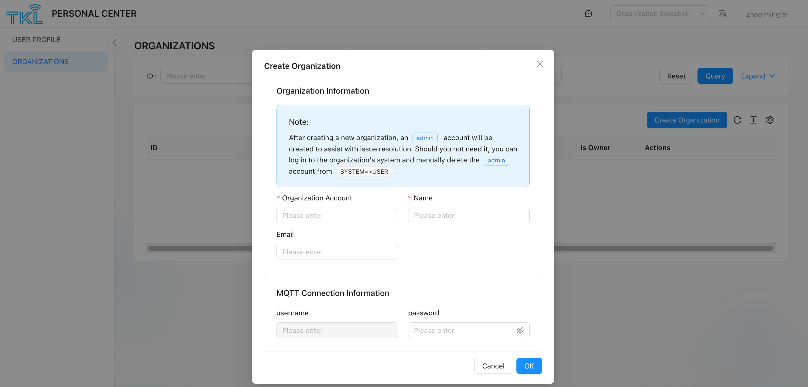

### organization Permission Description 
+ each user account **can only manage one organization as an administrator**. 
+ But can be as a member **join  other organizations**, and participate in collaboration within the scope of authority. 

### New Organization 
it is applicable to users who want to create a new organization and serve as its administrator. Note that after the user adds a new organization, the admin account will be automatically added to assist the user in handling problems. If the admin account is not required, please log on to the system page of the organization and clickSystem ->User  delete admin manually. 

1. Enter `ORGNIZATIONS `page, click **Creat Organization** button. 
2. Fill in the following required information (all fields need to be unique within the system): 

| field Name  | description  |
| --- | --- |
|**Organization Account** | the unique code used to identify the organization. It consists of lowercase letters, numbers, and underscores (_). This account will be used to generate the user code and be used as `tenant `field.  |
|**Name** | the display name of the organization, which can be used for external display.  |
|**MQTT password** | used for identity authentication when a third-party platform subscribes to ThinkLink data through the MQTT protocol. Please keep this password safely.  |

3. After confirming that the information is correct, click Submit, and the system will create a new organization, and the current user will automatically become the administrator of the organization. 

<!-- 这是一张图片，ocr 内容为：TIKL 刘 PERSONAL CENTER ZHAO MINGFEI ORGANIZATION SELECTION USER PROFILE ORGANIZATIONS ORGANIZATIONS X CREATE ORGANIZATION RESET ID: PLEASE ENTER QUERY EXPAND ORGANIZATION INFORMATION 招工 CREATE ORGANIZATION NOTE: AFTER CREATING A NEW ORGANIZATION,AN ADMIN ACCOUNT WILL BE IS OWNER ACTIONS CREATED TO ASSIST WITH ISSUE RESOLUTION.SHOULD YOU NOT NEED IT,YOU CAN Log IN TO THE ORGANIZATION'S SYSTEM AND MANUALLY DELETE THE THE ADMIN ACCOUNT FROM SYSTEM ORGANIZATION ACCOUNT NAME PLEASE ENTER PLEASE ENTER EMAIL PLEASE ENTER MQTT CONNECTION INFORMATION USERNAME PASSWORD PLEASE ENTER R PLEASE ENTER CANCEL -->

