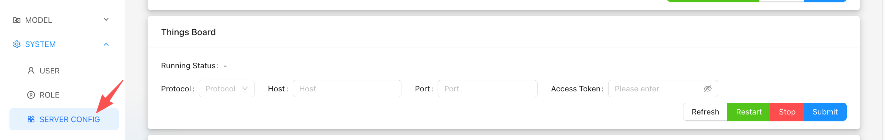
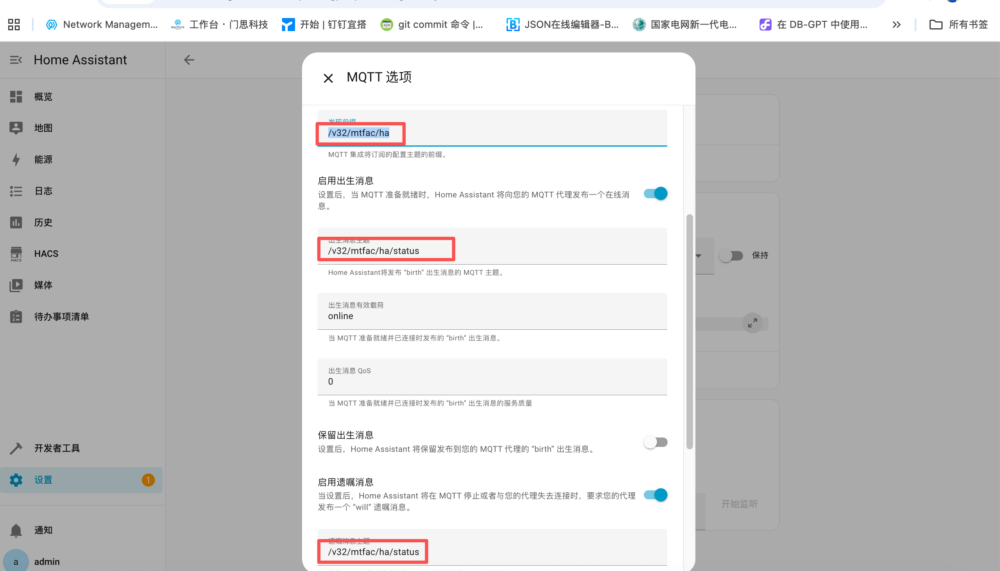

# 1. Server Configuration
## 1.1. ThingsBoard
ThinkLink does not provide the service of building the ThingsBoard server, but supports seamless data connection with the deployed ThingsBoard platform. By configuring relevant connection parameters, TKL can synchronize device data to ThingsBoard in real time, which is convenient for users to perform visual display and advanced application development. 

### 1.1.1. Get ThingsBoard connection information
+ **Protocol**: communication protocol 
+ **Host**: Server Address 
+ **Port**: Service Port 
+ **AccessToken**: Device Access Token 

<!-- 这是一张图片，ocr 内容为：设备 设备筛选器 告警 I仪表板 是否网关 客户 状态 标签 公开 名称 设备配置 创建时间 实体 非活动 2025-09-23 11:22:37 THINKLINK DEFAULT [品 设备 翻资产 设备凭据 福实体视图 凭扼类型 L GATEWAYS MQTT BASIC X.509 ACCESS TOKEN 配置 访问令牌 客户 IENPGFZD6J2KNKMVC4G6 规则链库 边缘管理 取消 保存 火高级功能 -->

### 1.1.2. fill in the ThingsBoard information
>**Operating Instructions**: 
>
> 1. log in to the TKL system and enter the "Server Configuration" page; 
> 2. find**ThingsBoard docking configuration** area; 
> 3. fill in the above four necessary information; 
> 4. click "Submit" to save the layout; 
> 5. when the configuration is complete, click the Restart button to start or update the ThingsBoard service connection. 
>

<!-- 这是一张图片，ocr 内容为：B MODEL THINGS BOARD @ SYSTEM V RUNNING STATUS: R USER PROTOCOL: PORT PORT: PROTOCOL HOST: HOST PLEASE ENTER ACCESS TOKEN: ROLE REFRESH STOP RESTART SUBMIT 86 SERVER CONFIG -->

### 1.1.3. Enable ThingsBoard functionality at the device level
completing the server configuration alone is not enough to activate data synchronization. You also need to enable the ThingsBoard synchronization function in the specific device management. 

1. Enter the "device management" module of TKL; 
2. select the device that needs to be docked to the ThingsBoard; 
3. in the device details page, find and enable the "ThingsBoard function" switch; 
4. save the configuration. 

✅ When enabled, the device and its properties, telemetry data, and entity information are automatically synchronized to the ThingsBoard platform.

<!-- 这是一张图片，ocr 内容为：TIKL THINKLINK DEVICE CONFIGURATION HOME DASHBOARD TRIGGER MODEL TELEMETRY DATA THING MODEL DEVICE ASSOCIATION RPC SHARED ATTRIBUTES SERVER ATTRIBUTES BASIC INFORMATION SELECTED APPLICATION DATA EUI 6353012AF1090468 KC11 NAME NETWORK DATA EUI MAINTENANCE DEVICE ONLINE STATUS TYPE DEVICE S000 2025-10-20 07:43:46 ACTIVE TIME PARENT EUI GATEWAY BACNET HEARTBEAT 86400 DTUX TAGS MANTHINK X PERIOD(S) PB DASHBOARD REAL-TIME UPGRADE THINGSBOARD STORAGE 6353 & MODEL BACNET HOMEASSISTANT SYSTEM GEOGRAPHIC THIRDPARTY PLEASE SELECT LOCATION CANCEL OK -->

### 1.1.4. View devices on ThingsBoard
when a device successfully ascends the first piece of data, ThingsBoard will automatically register the device (based on the provided accessstoken) and display it in its device list. Note: 

+ make sure `AccessToken `it is correct and has been pre-created on the ThingsBoard side; 
+ if the device does not appear, check the network connectivity, Port openness, and whether the Access Token is bound to the correct device; 
+ data Synchronization is bidirectional: TKL is responsible for data collection and processing, and ThingsBoard is responsible for display and rule engine processing. 

<!-- 这是一张图片，ocr 内容为：首页 设备 设备筛选器 告警 LI仪表板 是否网关 设备配置 公开 标签 名称 客户 状态 创建时间 实体 活动 6353012AF1093063 2025-09-23 11:30:11 DEFAULT G 设备 2025-09-2311:30:11 SS51A998FB001005 活动 DEFAULT 翻资产 实体视图 活动 6353012AF1093064 2025-09-23 11:29:49 DEFAULT GATEWAYS 2025-09-23  11:22:37 活动 THINKLINK DEFAULT 配置 客户 规则链库 边缘管理 -->

### 1.1.5. Attached: How to create an Access Token for a gateway
To create an Access Token for a gateway in the ThingsBoard platform, follow these steps: 

1. login to the ThingsBoard Web interface; 
2. create or select a device of type Gateway; 
3. enter the "Credentials" page of the device; 
4. copy or Build** Access Token **; 
5. fill this Token in the server configuration of TKL.

## 1.2. HomeAssistant
the HomeAssistant server needs to be built by the user and does not belong to the functional scope of the ThinkLink(TKL) system. TKL provides seamless connection with HomeAssistant to realize automatic discovery and synchronization of device information, attributes, and entities. 

After completing the relevant configuration, click **submission** button and click on the prompt **restart** to start the service connection with HomeAssistant. 

>**[Note]]**if you want the device to be fully displayed and used normally in HomeAssistant, you must enable it in the management configuration of the corresponding device.**HomeAssistant function**. When enabled, the device, its properties, and entities will be automatically discovered and rendered in the HomeAssistant page. 
>

### 1.2.1. Docking mode
TKL supports two Broker modes to integrate with HomeAssistant: 

+ use**MQTT Broker for ThinkLink** + use **HomeAssistant's MQTT Broker**

either way, make sure that the following two prerequisites are met: 

> ✅**Prerequisite 1:**  
the HomeAssistant related fields are correctly configured in the object model. For the configuration method, see Chapter 7.1. 
>

> ✅**Prerequisite 2**: enabled in the configuration page of the target device **HomeAssistant function**
>

<!-- 这是一张图片，ocr 内容为：THINKLINK TKL DEVICE CONFIGURATION HOME DASHBOARD TRIGGER MODEL TELEMETRY DATA DEVICE ASSOCIATION RPC BASIC INFORMATION SERVER ATTRIBUTES  SHARED ATTRIBUTES THING MODEL SELECTED APPLICATION DATA EUI KC11 6353012AF1090468 NAME NETWORK DATA EUI @MAINTENANCE STATUS ONLINE TYPE DEVICE DEVICE S000 2025-10-20 07:43:46 PARENT EUI ACTIVE TIME GATEWAY BACNET HEARTBEAT MANTHINK> DTU 86400 TAGS PERIOD(S) CASHBOARD REAL-TIME UPGRADE THINGSBOARD STORAGE 6353 WODEL BACNET HOMEASSISTANT @SYSTEM THIRDPARTY PLEASE SELECT LOCATION 5000 OK CANCEL -->

### 1.2.2. method 1: Use the Broker of ThinkLink
in this mode, the user's HomeAssistant server connects to the built-in MQTT Broker of ThinkLink as an MQTT client. 

#### 1.2.2.1. Configuration steps:
1. log in to your HomeAssistant server; 
2. enter **MQTT integration settings** to add a new MQTT Broker; 
3. enter the Broker connection information of ThinkLink, including: 
    - address (IP or domain) 
    - port 
    - username/Password 
4. set the following key parameters:
    - `discovery_prefix `(Service Discovery Prefix) 
    - `manufacturer `(Manufacturer Name) 
5. save the configuration and restart the HomeAssistant service. 

After completing the above operations, devices that have the HomeAssistant function enabled will be automatically discovered and displayed as corresponding entities in HomeAssistant. 

<!-- 这是一张图片，ocr 内容为：HOME ASSISTANT 概览 MQTT 添加MQTT设备 添加条目 地图 铂金 X MQTT 4 能源 集成条目 请输入您的 MQTT 代理的连接信息. 日志 本 LOCALHOST 历史 代理* 192.16 HACS MQTT 代理的主机名或 IP 地址. 媒体 端口* 1883 印 待办事项清单 MQTT 代理侦听的塔口,例如:1883. 用户名 登录您的 MQTT 代理的用户名. 密码 开发者工具 登录您的 MQTT 代理的密码. 设置 提交 -->

<!-- 这是一张图片，ocr 内容为：三HOME ASSISTANT 概览 MQTT 十添加MQTT设备 添加条目 地图 铂金品质 能源 集成条目 三日志 LOCALHOST 历史 HACS 媒体 待办事项清单 开发者工具 设置 -->

<!-- 这是一张图片，ocr 内容为：品 工作台门思科技 在DB-GPT中使用... 订钉宜搭 所有书签 开始| JSON在线编辑器-B... 国家电网新一代电... GIT COMMIT 命令|... NETWORK MANAGEM... 三HOME ASSISTANT 个 MQTT选项 地图 /V32/MTFAC/HA MQTT 集成将订阅的配置主题的前温. 能源 启用出生消息 三日志 设置后,当MQTT准备就缩时,HOME ASSISTANT 将向您的 MQTT代理发布一个在线消 息. 山 历史 /V32/MTFAC/HA/STATUS HACS 保持 HOME ASSISTANT将发布"BIRTH 出生消息的 MQTT 主题, 媒体 出生消总有效载荷 待办事项清单 ONLINE 当MQTT准备就堵并已连接时发布的"BIRTH"出生消总. 出生消息 QOS 当MQTT准备就结并已连接时发布的"HIRTH"出生消息的服务质量 保留出生消息 开发者工具 设置后,HOME ASSISTANT 将保留发布到您的MQTT 代理的"BIRTH"出生消息. 设置 启用遗嘱消息 当设置后,HOME ASSISTANT将在MQTT停止或者与您的代理失去连接时,要求您的代理 开始监听 发布一个"WILL"透嘱消息. 通知 /V32/MTFAC/HA/STATUS ADMIN -->

### 1.2.3. Method 2: Use the Broker of HomeAssistant
in this mode, the ThinkLink will actively connect to the MQTT Broker provided by HomeAssistant as a client. 

### 1.2.4. Validation
after completion, ThinkLink releases device information to HomeAssistant through the MQTT protocol to realize automatic entity registration and status synchronization. 

✅  **Verify success:**  
go to the "devices and services" page of HomeAssistant, check whether there are new devices from ThinkLink, and check whether its sensors, switches and other entities are displayed and updated normally. 

<!-- 这是一张图片，ocr 内容为：HOME ASSISTANT 概览 MQTT 地图 添加条目 添加MQTT设备 铂金品质 4个设备12个实体 能源 集成条目 日志 历史 LOCALHOST HACS 6353012AF1093061 MANTHINKT&H.3个实体 媒体 6353012AF1093062 待办事项清单 MANTHINKT&H.3个实体 开发者工具 6353012AF1093063 MANTHINKT&H.3个实体 设置 6353012AF1093064 MANTHINKT&H.3个实体 通知 ADMIN -->

## 1.3. BACnet
>**attention**: The BACnet Service function can only be used on independently deployed TKE devices. This function is not available in the Cloud Service version. 
>

ThinkLink(TKL) allows device data in the TSL to be exposed to the outside using the standard BACnet protocol for easy integration with the building management system (BMS). To implement the full functionality of the BACnet service, complete the following two steps: 

1. configure the BACnet attribute of the relevant fields in the thing model; 
2. enable the BACnet feature on the target device and configure the server parameters correctly. 

### 1.3.1. BACnet field configuration
Before enabling the BACnet service, you must **thing Model** configure the corresponding BACnet attribute for the field to be mapped externally. Please refer to document 7.1 for specific configuration methods. 

### 1.3.2. Server Configuration
For to successfully run TKL as a BACnet server, you need to configure the following core parameters in the system. All settings are located in **MAINTENANCE → BACnet** under the menu. 

Please ensure that you have enabled the BACnet service for the device before completing the detailed configuration here, and export the generated BACnet point table to the BMS platform for use. 

|  Item  | description  | default Value  | can be modified  |
| --- | --- | --- | --- |
|**IP address** | the local IP address of the TKL device, which is used for BACnet communication.    If set `0.0.0.0 `, indicating that all network interfaces are bound  | `0.0.0.0 ` | yes  |
|**Port** | BACnet service listening port  | `47808 `(Decimal)    (I. E., UDP port 0xbac0)  | yes, adjustable according to BMS requirements  |
|**Device ID** | BACnet device unique identifier, must be unique within the system    need to negotiate with BMS platform  | `1 ` | yes  |
|**Vendor Identifier** | vendor identification number, representing the equipment manufacturer  | `99`(Unofficial reserved value, it is recommended to fill in according to the actual)  | yes  |
|**Device Name** | device name, for displaying in BMS  | `TKE ` | yes, it is recommended to modify according to site naming convention  |
|**Max APDU Length Accepted** | maximum acceptable APDU length, affecting communication efficiency and compatibility  | `1024 ` | yes, adjust for client capabilities  |
|**Segmentation Supported** | segmentation support mode, which defines whether the device supports segmented transmission  | `segmentedBoth `   (Means both sending and receiving can be segmented)  | yes, optional:    `noSegmentation `   `segmentedTransmit `   `segmentedReceive `   `segmentedBoth ` |

After completing the above configuration, please enter**point Table Management** the module views or exports the BACnet object list (that is, the point table) of the current device and delivers it to the BMS integrator for access and monitoring.**Prompt**:

+ After modifying the configuration, you need to restart the BACnet service or related devices to take effect. 
+ We recommend that you confirm the specific requirements of the preceding parameters with the BMS integrator to avoid connection failure due to protocol mismatch. 
+ The BACnet over IP protocol is built based on UDP to ensure that the corresponding port is allowed to pass through at the network level. 
