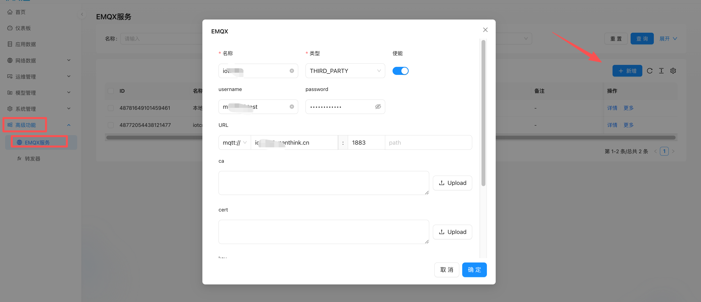

MQTT转发器是用于实现第三方应用平台协议对接的中间件解决方案，通过灵活的JS脚本处理实现：

+ 跨平台消息路由（source→target broker）
+ 动态Topic重定向
+ 消息内容格式转换

## 配置流程
### 第一步：建立Broker连接
1. 准备认证信息：
    - 账号/密码
    - TLS证书（如需加密连接）
2. 连接类型选择：
    - 常规MQTT Broker：需填写完整连接信息
    - TKL生态数据：
        * AS类型：获取LoRaWAN解析后的应用层数据，订阅的topic权限是 /v32/[tenant]/as/#
        * ThinkLink 类型： 获取的是经ThinkLink 物模型解析后的数据，订阅的topic的topic /v32/[tenant]/tkl/#

> 注意：至少需建立2个Broker连接（source+target）
>

<!-- 这是一张图片，ocr 内容为：公首页 EMQX服务 仪表板 EMQX 名称: 请输入 展开V 目应用数据 使能 名称 网络数据 工本 THIRD PARTY 新增 IO. 网运维管理 操作 名称 备注 图模型管理 侧 MAST 48781649101459461 本时 详情更多 @系统管理 URL 粗高级功能 详情史多 IOTC 48772054438121477 画 EMQX服务 1883 MGTT:// PATH 第1-2条港共2条 UPLOAD UPLOAD 确定 取消 -->


### 第二步：配置转发规则
<!-- 这是一张图片，ocr 内容为：TKL THINKLINK EMQX SCRIPT 合首页 转发器 使能 名称 仪表板 请选择 TARGOTBROKER: 名称 请洗择 SOURCEBRUKER: 应用数据 TARGET BROKER SOURCE BROKER 网络数据 48781649101459461 本场 1438121477) 印运维管理 名称 使能 自定义制本 自定义固本 SUBSCRIPTION TOPIC 四模型管理 48787883938549765 开启 IOTCN02(48772054438121477) 开启 @系统管理 GWMS/UP/+ FUNCTION FORWARDSCRIPT(FTOPIC. MSG))( 高级功能 2 IF (!MSQ?.UHEART?,EUI LL MSQ?.UHEART?.ACTLON !- "HEART' ) RETURN MULL; 零 EMQX服务 LET VALIDEUILIST- '5A53012A 8126BR 11481433 火转发招 LET EWI , NSG?.UHEART?.EUT; IF(!WALIDEUILIST.INCLUDES(EUI)L RETURM; /NNS/UP/ 1432/ VERSION:"3.0", EU1, 14 16 17 NSG?UHEART?. TLEV 18 ES:  ASG?UHEART PACKETS, XPA 19 TXPS ES:WSG7.UHEART? 20 MDLE:WSG7.UHEAR DEVI EVICELLANDLE, ROVERSION, IN:    UHEART?.K FWVE M:NSG7.UHCART?.FIM. 备注 请输入 确定 取消 -->


1. 进入配置界面：  
[高级功能] → [转发器] → [新增]
2. 基础设置：
    - 命名转发器实例
    - 启用功能开关
3. 端点配置：
    - Source Broker（下拉选择，若无则需新建）
    - Target Broker（下拉选择，若无则需新建）
    - 订阅Topic（支持通配符）

### 可选：协议转换脚本
```javascript
/**
* 消息转换函数
* @param {Object} input - 原始消息
* @param {string} input.topic - 来源topic
* @param {Object} input.msg - 消息体(JSON)
* @returns {Object|null} 返回null则丢弃消息
*/
function forwardScript({topic, msg}) {
  // 示例：设备心跳消息过滤转换
  if (!msg?.uheart?.EUI || msg?.uheart?.action != 'heart') return null;

  const VALID_EUIS = ["7a53012a00000070", "7a53012a00000331"];
  const eui = msg.uheart.EUI;
  if (!VALID_EUIS.includes(eui)) return null;

  // 构造目标消息格式
  return {
    topic: `/v32/test/my/up/gw/${eui}`,  // 支持模板变量
    option:{
      retain:false
    }
    msg: {
      version: "3.0",
      eui: eui,
      action: "heart",
      data: {  // 字段映射
        validIP: msg.uheart?.IP,
        txPackets: msg.uheart?.TxPackets,
        rxPackets: msg.uheart?.RxPackets,
        deviceHandle: msg.uheart?.deviceHandle,
        hwVersion: msg.uheart?.hardwareVersion,
        fwVersion: msg.uheart?.fimewareVersion,
        netType: msg.uheart?.netType
      }
    }
  }
}
```

+ **<font style="color:rgb(0, 0, 0);">输入参数</font>**|**<font style="color:rgb(0, 0, 0);">参数</font>**|**<font style="color:rgb(0, 0, 0);">类型</font>**|**<font style="color:rgb(0, 0, 0);">说明</font>** |
| --- | --- | --- |
| `<font style="color:rgb(0, 0, 0);">topic</font>` | `<font style="color:rgb(0, 0, 0);">string</font>` | <font style="color:rgb(0, 0, 0);">订阅到的原始MQTT Topic</font> |
| `<font style="color:rgb(0, 0, 0);">msg</font>` | `<font style="color:rgb(0, 0, 0);">Object</font>` | <font style="color:rgb(0, 0, 0);">接收到的消息内容（JSON格式）</font> |


+**<font style="color:rgb(0, 0, 0);">返回值</font>**

<font style="color:rgb(0, 0, 0);">返回一个新的消息对象（或 </font>`<font style="color:rgb(0, 0, 0);">null</font>`<font style="color:rgb(0, 0, 0);"> 以丢弃该消息）：</font>

|**<font style="color:rgb(0, 0, 0);">字段</font>**|**<font style="color:rgb(0, 0, 0);">类型</font>**|**<font style="color:rgb(0, 0, 0);">说明</font>** |
| --- | --- | --- |
| `<font style="color:rgb(0, 0, 0);">topic</font>` | `<font style="color:rgb(0, 0, 0);">string</font>` |**<font style="color:rgb(0, 0, 0);">目标Topic</font>**<font style="color:rgb(0, 0, 0);">，可使用 </font>`<font style="color:rgb(0, 0, 0);">${变量}</font>`<font style="color:rgb(0, 0, 0);">动态替换（如 </font>`<font style="color:rgb(0, 0, 0);">${msg.deviceId}</font>`<font style="color:rgb(0, 0, 0);">）</font> |
| `<font style="color:rgb(0, 0, 0);">msg</font>` | `<font style="color:rgb(0, 0, 0);">Object</font>` | <font style="color:rgb(0, 0, 0);">转换后的消息内容（需符合目标协议规范）</font> |
| option | object | <font style="color:rgb(0, 0, 0);">如果要发送retain 消息，则option:{retain:true}</font> |

