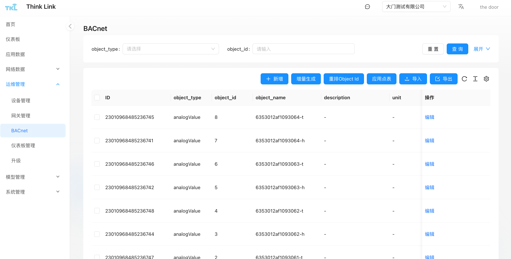

# 1. BACnet
> 注意：BACnet 功能只在TKG（网关运行TKL）和TKE（边缘侧服务器）支持，云平台不支持BACnet
>

若用户的 BMS（楼宇管理系统）需要正式部署，通常需提供标准的 BACnet 点表文件，以便于系统集成与调试，在生成BACnet点表前需要在物模型中配置BACnet字段，请查看第7.1章节中关于BACnet字段的相关描述

1. 进入 **运维管理 → BACnet** 模块。
2. 点击**增量生成** 按钮。
3. 在弹出的窗口中选择目标**物模型**。
4. 确认后，系统将自动生成对应物模型下所有 BACnet 字段的点表信息。

生成后的点表包含：对象类型、对象实例号、对象名称、属性描述、数据类型、单位、读写权限等关键信息，可用于交付给第三方系统进行对接。

<!-- 这是一张图片，ocr 内容为：THINK LINK 大门测试有限公司 THE DOOR 仪表板 BACNET 应用数据 X 增量生成 重置 查询 展开 OBJECT_TYPE: 物模型 网络数据 MANTHINKT&H 运维管理 C 凸导出 山 导入 取消 确定 设备管理 ID 操作 OBJECT_ID OBJECT TYPE OBJECT_NAME DESCRIPTION UNIT 网关管理 BACNET 仪表板管理 暂无数据 升级 造型管理 -->

<!-- 这是一张图片，ocr 内容为：THINK LINK 大门测试有限公司 THE DOOR TIKI 首页 BACNET 仪表板 重置 请选择 OBJECT_ID: 查询 展开 请输入 OBJECT_TYPE: 应用数据 网络数据 飞导出 +新增 重排OBJECT ID 增量生成 导入 应用点表 运维管理 1D 操作 OBJECT ID DESCRIPTION OBJECT TYPE UNIT OBJECT NAME 设备管理 网关管理 6353012AF1093064-T 编辑 8 23010968485236745 ANALOGVALUE BACNET 7 编辑 6353012AF1093064-H 23010968485236741 ANALOGVALUE 仪表板管理 升级 编辑 6353012AF1093063-T 6 23010968485236746 ANALOGVALUE 模型管理 5 6353012AF1093063-H 编辑 23010968485236742 ANALOGVALUE 系统管理 4 编辑 23010968485236748 6353012AF1093062-T ANALOGVALUE 绵辑 6353012AF1093062-H 23010968485236744 ANALOGVALUE 编辑 23010968485236747 6353012AF1093061-T ANALOGVALUE -->

