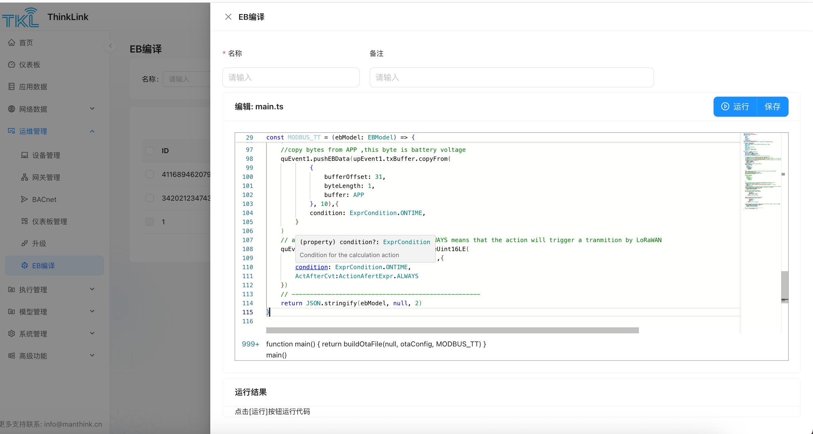

# 1. EBCompiler
<!-- 这是一张图片，ocr 内容为：TKL THINKLINK DEMO 金首页 EB编译 仪表板 请输入 来源: 名称: 重置 请选择 查询 展开 目应用数据 网络数据 工 章 +新增 四运维管理 备注 名称 来源 ID 操作 品设备管理 自定义 123 缩辑 41168946207920133 CESHI1 品网关管理 34202123474309125 编辑 自定义 CJ188T BACNET 1 昭仪表板管理 缩辑 系统 EXAMPLE 升级 第1-3条/总共3条 中EB编译 -->

EB（EdgeBus）是一款运行在低功耗MCU上的虚拟机，EB是基于通过TypeScript编程可实现复杂传感器对接业务。EB的详细介绍见 [[CN] AN-25100101 EB compiler SDK使用说明](https://mensikeji.yuque.com/staff-zesscp/gqdw7f/trz8i5b7iddrug10?singleDoc#) 。

ThinkLink 提供了EB的云编译平台，用户输入TypeScript代码后，即可实现在线编译成obin文件用于设备升级。

## 1.1. 新增EB代码
> 注意1 ：与使用SDK不同的是，main 函数 编写和运行已经内置到云编译内部，在代码中需要剔除。
>
> 注意2 ：每个代码要保持BzType 和 BzVersion 的组合是唯一的，否则会造成设备升级失败
>
> 注意3 :   SwVersion的版本要与设计设备的固件版本保持一致，当前最新的EB版本为31
>

- [ 1 ] 点击新增后，系统会默认给出一个示例，将编写好的代码将示例代码替换即可。
- [ 2 ] 给EB代码起个名字，加上备注
- [ 3 ] 点击运行后，可生成对应的obin文件
- [ 4 ] 点击保存固件包，可将编译生成的固件包保存到系统中，用于EB升级。
- [ 5 ] 点击保存，可EB的代码保存到系统中

<!-- 这是一张图片，ocr 内容为：TIKL THINKLINK EB编译 首页 EB编译 备注 名称 仪表板 请输入 请输入 名称: 请输入 目应用数据 运行 编辑:MAIN.TS 保存 网络数据 风运维管理 29 CONST MODBUS_TT -(EBMODET:EBMODEL) { 97 F/COPY BYTES FROM APP ,THIS BYTE IS BATTERY VOLTAGE 口设备管理 98 QUEVENT1.PUSHEBDATA(UPEVENTI.TXBUFFER.COPYFROM( 99 411689462079 品网关管理 BUFFEROFFSET:31, 188 BYTELENGTH:1, 181 182 BUFFER:APP 342021234748 BACNET 183 1,10),1 104 CONDITION: EXPRCONDITION.CNTIME, 昭仪表板管理 105 106 107 (PROPERTY) CONDITION?: EXPRCORDITION MAYS MEANS THAT THE ACTION WILL TRI99ER A TRANMITION BY LORAWAN P升级 108 UINT16LE( CONDITION FOR THE CALCULATION ACTION 109 EB缠详 CONDITION:EXPRCONDITION.ONTIME, 111 ACTAFTERCVT:ACTIONAFERTEXPR.ALWAYS 图执行管理 113 114 RETURN JSON.STRINGIFY(EBMODEL,NUL1, 2) 图 模型管理 115 116 系统管理 999+FUNCTION MAIN()[RETURN BUILDOTAFILE(NULL,OTACONFIG.MODBUS_TT)] 铝高级功能 MAIN() 运行结果 点击[运行]按钮运行代码 更多支持联系:INFO@MANTHINK.CN -->

