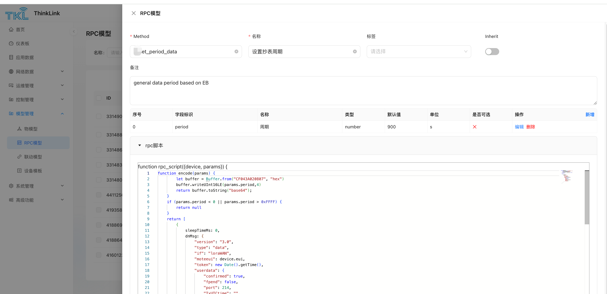

# 1. RPC 模型
ThinkLink（以下简称 TKL）的 **RPC 模型** 提供了对 LoRaWAN 设备进行远程控制和参数配置的能力。通过定义标准化的远程过程调用（Remote Procedure Call），用户可以向设备下发指令、设置工作参数或触发特定动作，实现设备的智能化运维管理。

## 1.1. 新建 RPC
在 TKL 平台中，可通过以下步骤创建一个新的 RPC 命令：

1. 进入**模型管理 → RPC模型 → 新增**。
2. 配置基本信息与脚本逻辑。

<!-- 这是一张图片，ocr 内容为：TKL THINKLINK X RPC模型 首页 RPC模型 标签 名称 METHOD 仅表板 设置抄表周期 话选择 ET_PERIOD_DATA 名称 请输 目 应用数据 备注 网络数据 GENERAL DATA PERIOD BASED ON EB 沼运维管理 阳 控制管理 图 模型管理 单位 类型 是否可选 新增 序号 名称 操作 字段标识 331490 X 0 周期 005 S NUMBER PENOD 点物模型 因 RPC模型 RPC脚本 联动模型 FUNCTION RPC_SCRIPT((DEVICE,PARAMS))( 设备模板 FUNCTION ENCODELPARANS] BUFFER.WRITEUINT16LE(PARANS.PERIOD.4) 系统管理 RETURN BUFFER.TOSTRING("BASE64"); 441125 昭高级功能 (PARANS.PERIAD < & LL PARANS.PERIOD > OXFFF) L RETURN NULL "TYPE"DATA". 416012 FPEAD:FALSE, 'PORT:214, -->


## 1.2. 参数信息
| 字段 | 说明                                                            |
| -- |---------------------------------------------------------------|
|**字段标识** | 参数在脚本中的变量名，即 params 对象中的键名。例如：period 表示上报周期值，该名称将用于脚本中读取用户输入。 |
|**Method** | 通过 MQTT 或其他方式调用时使用的函数名称。                                      |
|**别名** | 在用户界面中显示的提示名称，提升可读性。例如：“修改周期”，方便用户理解参数含义。                     |
|**Inherit** | 是否继承至子设备：<br>✅ true：设备下的子设备可使用此 RPC；<br>❌ false：子设备不可使用。      |


> ✅ 支持添加多个参数字段，以满足复杂控制需求。
>

## 1.3. RPC 脚本
TKL 支持使用 JavaScript 编写自定义编码脚本，将用户输入转化为符合设备通信协议的数据格式，并通过下行链路发送至目标设备。

示例脚本：

```javascript
 let classMode = (device && device.shared_attrs && device.shared_attrs.class_mode) || "ClassA";
    let sleepMs = classMode === "ClassA" ? 200 : 10000;
    let isClassA = classMode === "ClassA";

    function getDevicesInfo() {
        let buffer = Buffer.alloc(4)
        buffer[0] = 0x8F;
        buffer[1] = 2;
        buffer[2] = 100;
        buffer[3] = 96
        return buffer.toString("base64");
    }
    function processSubAddr(subAddr, modelHex) {
        let addrBuffer;
        let laddrBuffer = Buffer.alloc(7);
        let substr = subAddr.replaceAll(" ", "")
        if (substr==="nc"||substr===""){ return null}
        if (modelHex.length != 10) {    return null}
        let subnum = parseInt(substr, 10)
        if (subnum == 0) {
            for (let i = 0; i < 7; i++) {   laddrBuffer[i] = 0; }
        } else {
            addrBuffer = Buffer.from(substr, 'hex');
            if (addrBuffer.length != 7) {   return null }
            for (let i = 0; i < 7; i++) {   laddrBuffer[i] = addrBuffer[6 - i]; }
        }
        let hexStr = laddrBuffer.toString('hex') + modelHex;
        const buffer = Buffer.from(hexStr, 'hex');
        return buffer;
    }
    function encode(params) {
        let buffer = Buffer.alloc(98);
        buffer[0] = 0xCF;
        buffer[1] = 76;
        buffer[2] = 100;
        buffer[3] = 96;
        let dataSize=0
        let serverAttrs={}
        for (let i = 0; i < 6; i++) {
            const subAddr = params['sub_addr' + (i + 1)];
            if (!subAddr) {
                buffer.writeUint32LE(0xFFFF,i*2+4) //10 years
                continue
            }
            if (subAddr==="nc") {
                buffer.writeUint32LE(0xFFFF,i*2+4) //10 years
                continue
            }
            const modelHex = params['model' + (i + 1)];
            if (modelHex==="0000000000")  {
                buffer.writeUint32LE(0xFFFF,i*2+4) //10 years
                continue
            }
            let period = params['period' + (i + 1)];
            let payload = processSubAddr(subAddr, modelHex);
            serverAttrs['sub_' + subAddr.replaceAll(" ", "")]={
                addr:subAddr.replaceAll(" ", ""),
                model: modelHex,
                period: period,
            };
            serverAttrs['model' + (i + 1)]=modelHex;
            serverAttrs['period' + (i + 1)]=period;
            if (payload===null) {
                buffer.writeUint32LE(0xFFFF,i*2+4) //10 years
                continue
            }
            period=(period)&0x7FFF
            period|=0x4000
            buffer.writeUint32LE(period,i*2+4)
            payload.copy(buffer,26+i*12,0,12)
            dataSize+=12
        }
        if (dataSize==0){ return null}
        buffer[1]=24+dataSize;
        buffer[3]=22+dataSize;
        let retBuffer=Buffer.alloc(26+dataSize);
        buffer.copy(retBuffer,0,0,26+dataSize);
        return {
            sAttrs:(Object.keys(serverAttrs).length < 1)?null:serverAttrs,
            payload:retBuffer.toString("base64")
        }
    }
    let rdata=encode(params)
    if (rdata==null){ return null}
    return [
        {
            sleepTimeMs: 100,
            type:"modifyAttrs",
            dnMsg: {
                server_attrs: rdata.sAttrs,
            }
        },
        {
            sleepTimeMs: 0,
            dnMsg: {
                "version": "3.0",
                "type": "data",
                "if": "loraWAN",
                "moteeui": device.eui,
                "token": new Date().getTime(),
                "userdata": {
                    "confirmed": isClassA,
                    "fpend": false,
                    "port": 214,
                    "TxUTCtime": "",
                    "payload": rdata.payload,
                    "dnWaitms": 3000,
                    "type": "data",
                    "intervalms": 0
                }
            }
        },
        {
            sleepTimeMs: sleepMs,
            dnMsg: {
                "version": "3.0",
                "type": "data",
                "if": "loraWAN",
                "moteeui": device.eui,
                "token": new Date().getTime() + 1,
                "userdata": {
                    "confirmed": true,
                    "fpend": false,
                    "port": 214,
                    "TxUTCtime": "",
                    "payload": getDevicesInfo(),
                    "dnWaitms": 3000,
                    "type": "data",
                    "intervalms": 0
                }
            }
        }
    ];
```

### 1.3.1. 输入参数
1. `device`

表示目标设备对象，可用于访问以下属性：
- `device.shared_attrs` ：共享属性
- `device.server_attrs` ：服务端属性
- `device.telemetry[thingmodelId]`：最后一次遥测数据,`thingsmodelId` 用实际的id替换，例如 device?.telemetry_data?.["45616600866361349"].TP 

📌当通过 MQTT 或 HTTP 调用 RPC 时，需显式传入设备 EUI，字段名为 `_eui`

2. `params`

包含所有用户输入参数的对象。每个参数具有以下属性：

| 属性名  | 用途说明|
|------| --- |
| **变量名** | 用于在 JS 脚本中通过 `params.xxx`访问该参数 |
| **序号** | 控制参数显示顺序|
| **别名** | 用户界面上展示的友好名称|
| **类型** | 支持类型：`number`,`string`, `boolean`, `object` |
| **默认值** | 若未填写，则使用默认值|
| **单位** | 显示时附加的物理单位（如 s、min、℃） |
| **可选值** | 提供下拉选择项，格式为键值对列表 |


3. `alarms`

 	保存了对应设备的报警信息，通过alarms[[alarm_name]] 即可获取对应的alarm_name的告警是否存在。RPC代码可以根据对应告警状态进行对应的逻辑处理。

4. `logger`

  RPC日志,logger的使用方法与console一致，其中用户需要记录的信息需要以Object方式作为params的变量传入。logger支持 info，warn，error 三种等级的日志记录，方便通过等级进行信息查找.

示例如下：

```json
logger.info("set my paras", {params: paras})
```

### 1.3.2. 返回参数
一条 RPC 可支持连续执行多条指令。每条指令遵循如下结构：

1. 类型一：发送设备指令（LoRaWAN 或非 LoRaWAN 设备）

适用于通过 Topic 按照标准协议格式下发给设备的消息，topic 参考 
[CN] PTL-S05 ASP LoRaWAN NS 与应用服务器通信协议V3.2

LoRaWAN设备的消息的JSON格式参考上述协议内容，示例如下：

```json
{
    "version": "3.0",
    "type": "data",
    "if": "loraWAN",
    "moteeui": "ABCDEF1234567890",
    "token": 1712345678901,
    "userdata": {
        "confirmed": true,
        "fpend": false,
        "port": 214,
        "TxUTCtime": "",
        "payload": "base64_encoded_data",
        "dnWaitms": 3000,
        "type": "data",
        "intervalms": 0
    }
}
```

> 🔗 非 LoRaWAN 设备应按照此消息格式侦听对应 Topic。
>

2. 类型二：修改设备属性

通过设置 `type: "modifyAttrs"`实现对设备属性的更新操作，可修改server_attrs 和shared_attrs。 以下是修改 sever_attrs 的示例：

```json
{
    sleepTimeMs: 100,
    type: "modifyAttrs",
    dnMsg: {
        server_attrs: { 
            covtemp: 15 
        },
    }
}
```

该操作会将指定属性写入平台数据库，无需发送到终端设备。

3. 类型三：告警

通过设置 type: "alarm"实现告警功能。一个设备/资产要实现告警功能，需要用户配置触发联动功能，在触发联动字段配置触发逻辑，通过alarm的RPC实现告警通知功能。

对应字段说明：

| 字段| 说明|
| --- | --- |
| `action` | 告警动作的类型，有两种"new" ： 新增一个告警事件"clear"：清除该告警事件 |
| `alarm_name` | 对应的告警事件，一个名字对应一种告警事件，告警事件需要用户自行管理，不同的告警事件名字不能重复 |
| `notice_groups` | 邮件通知组，当选中通知组，告警事件发生事，将通过邮件发送给对应的邮箱组 |
| `title` | 告警事件发生时的标题 |
| `desc` | 告警事件的描述 |
| `level` | 告警等级，分为 "low","mid","hight","urgent" 三种。 |


示例如下：

```javascript
{
  sleepTimeMs: 0,
    target: device.eui,
    type:"alarm",
    dnMsg: {
    action:"new",
      data:{
        alarm_name: "alarm test",
        notice_groups: [],
        title: title,
        desc:  "this is a alarm",
        level: "high",
      }
   }
}
```

4. 共同字段说明

|字段 | 说明                                                            |
| --- |---------------------------------------------------------------|
| `sleepTimeMs` | 发送前等待时间（毫秒），用于控制多条指令间的延迟。                                     |
| `target` | 默认为目标设备的 `eui`；<br>当操作子设备时，因指令需通过父设备转发，此处应设为 `device.parent`。 |
| `type` | 指令类型：<br>`default`：普通下行消息<br>`modifyAttrs`：修改服务端/共享属性         |


## 1.4. 挂载 RPC
创建完成的 RPC 需要绑定到具体设备才能使用。**操作路径**：  
`运维管理 → 设备管理 → 选择目标设备 → 详情 → RPC`**操作步骤**：

1. 在设备详情页点击 “RPC” 标签。
2. 点击 “新增”，从下拉列表中选择已创建的 RPC。
3. 可重复添加多个不同的 RPC 到同一设备。

✅ 支持一个设备挂载多个 RPC，适用于多功能控制场景。

## 1.5. 执行 RPC
当 RPC 成功挂载后，即可对设备执行远程调用。**操作路径**：  
同上，进入设备详情 → RPC 管理界面**操作方式**：

1. 找到已挂载的 RPC 条目。
2. 点击对应操作列的**执行】** 按钮。
3. 弹出输入窗口，填写各参数值（根据“别名”提示输入）。
4. 确认后，系统将调用脚本生成指令并发送至设备。

📌 执行结果可在日志或设备响应中查看，依赖于设备回传机制与确认模式设置（Confirmed/Unconfirmed）。

通过灵活配置**RPC 模型**，TKL 实现了对 LoRaWAN 设备的精细化远程控制能力，为设备调试、配置更新与故障处置提供了高效手段。

## 1.6. 告警RPC
ThinkLink已经内置了通用告警RPC功能，ALARM，使用时需要将ALARM的RPC挂载到对应的设备或者资产上。配置触发联动逻辑后，即可实现告警功能。默认的ALARM如下：

```javascript
function rpc_script({device, params,alarms,logger}) {
    const ACTION = {  no:"no","new": 'new',clear: 'clear'};
    let group = params?.group?.notify ?? []
    let alarm_name = params?.name ?? "[alarm]";
    let action = params?.action ?? ACTION.no;
    let title = params?.title ?? "[tile]";
    let desc = params?.desc ?? "this is a description of alarm";
    let level = params?.level ?? "low";
    switch (action){
        case ACTION.clear: break;
        case ACTION.new:
            let alarmInfo=alarms[alarm_name]
            if (alarmInfo===undefined){break}
            if (alarmInfo.title!==title){break}
            if(alarmInfo.desc!==desc) {break}
            if (alarmInfo.level!==level) {break}
            action = ACTION.no
            break
        default: return null
    }
    if(action===ACTION.no){ return null}
    return [
        {
            sleepTimeMs: 0,
            target: device.eui,
            type:"alarm",
            dnMsg: {
                action:action,
                data:{
                    alarm_name: alarm_name,
                    notice_groups: group,
                    title: title,
                    desc:  desc,
                    level: level,
                }
            }
        }
    ]
}
```

告警触发规则示例如下：

```javascript
function trigger_script(device, thingModelId) {
    const ACTION = {  no:"no",new: 'new',clear: 'clear'};
    const LEVEL={low:'low',mid:'mid',high:'high',urgent:'urgent'}
    let name="alarm_bin"
    let title="Alarming : ["+device.name+"]"
    let desc=""
    let level=LEVEL.high
    let group=device.server_attrs?.group===undefined??[];
    let action=ACTION.clear
    let tdata=device?.telemetry_data[thingModelId]
    if(tdata?.depth==undefined&&tdata?.weight1==undefined){ return null}
    if (tdata?.depth<=device.server_attrs.alarm_depth) {
            desc="["+device.name +"]"+"warning, please process "
            action=ACTION.new
    }
    if (tdata?.weight1 >= device.server_attrs.alarm_weight) {
            desc="["+device.name +"]"+"caution!!!!"
            action=ACTION.new
    }
    return {
        delayms: 0,
        abort_previous_timer: true,
        actions: [{
            method: "alarm",
            params: {
                _eui:device.eui,
                action:action,
                name:name,
                title:title,
                level:level,
                desc:desc,
                group:group
            }
        }]
    }
}
```
