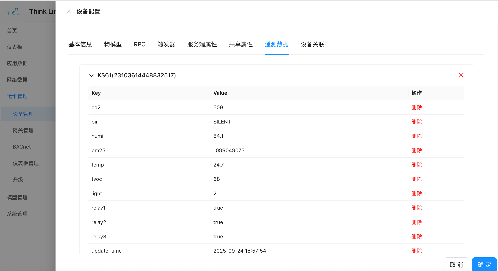

物模型（Thing Model）是 ThinkLink 平台中用于定义设备功能和数据结构的核心模块。通过物模型，可以将来自 LoRaWAN 网络服务器（NS）或其他协议接入的原始数据解析为标准化的应用层数据（如遥测数据、属性信息），并支持在表格、图表或仪表盘中进行可视化展示。

## 创建物模型
新建一个物模型时，需输入**唯一名称**作为标识。该名称在整个系统内不可重复，建议根据设备类型或功能命名（例如：温湿度传感器_型号A）。

创建完成后，可通过配置“解析脚本”实现对上行数据的解码与映射。

<!-- 这是一张图片，ocr 内容为：物模型配置 标签 名称 MANTHINKT&H KS52X 自定义 测试 CHIRPSTACK PAYLOAD解析脚本 FUNCTION PAYLOAD_PARSER((DEVICE,MSG,THINGMODELLD))( LET BYTES-BUFFER.FROM(MSG.USERDATA.PAYLOAD,"BASE64") LET FPORT MSG.USERDATA.PORT RETURN THING_MODEL:THINGMODELID, EUI: DEVICE.EUI, DEVICE.TELEMETRY_DATA [THINGMODELID] RETURN ( TELEMETRY_DATA:DECODE(FPORT,BYTES)) 属性配置: -->


## 解析脚本说明
解析脚本的作用是将外部平台发送至 ThinkLink 的原始数据转换为结构化的**遥测数据（telemetry_data）**和**共享属性（shared_attrs）**，以便后续应用处理与展示。

### 输入参数
脚本执行时，系统自动传入以下参数：

| 参数名 | 类型 | 说明 |
| --- | --- | --- |
| `device` | Object | 消息所属设备对象，包含当前设备的所有属性及历史数据。 |
| `msg` | Object | 来自 LoRaWAN 应用服务器（AS）的数据包原始信息。若为 MQTT 接入，则为 JSON 格式的消息体。 |
| `thingModelId` | String | 当前物模型的唯一 ID，用于获取该设备对应物模型的历史遥测数据。 |
| `noticeAttrs` | Object | 标识哪些属性发生变化并触发通知事件，用于条件判断。 |


>**提示**：若您已有基于 ChirpStack 编写的解析脚本，可直接选择** ChirpStack 兼容模式**。ThinkLink 已完成接口适配，只需复制原代码即可无缝运行。
>

### 遥测模型参考代码
以下是一个典型的 LoRaWAN 温湿度传感器的解析脚本示例，适用于端口为 `11`、固定长度为 `15` 字节的二进制负载。配置参数（COV阈值，周期等）通过214端口发送数据，通过214端口返回，物模型将配置参数解析到共享属性中。

```javascript
let    payload = Buffer.from(msg?.userdata?.payload, "base64");
    let    port=msg?.userdata?.port || null;
    function parseSharedAttrs(payload) {
        if (port!=214||payload[0]!=0x2F) { return null}
        let shared_attrs = {};
        if (payload.length<5) { return null}
        shared_attrs.content = payload.toString('hex');
        let size=payload.length-4
        let regAddress=payload[2]
        for (let i=0; i<size; i++) {
            regAddress=payload[2]+i
            switch (regAddress) {
                case  58:
                    if  ( size<(2+i) ) { break }
                    shared_attrs.period_data = payload.readUInt16LE(4+i)
                    break;
                case 142:
                    if  ( size<(2+i) ) { break }
                    shared_attrs.period_measure = payload.readUInt16LE(4+i)
                    break;
                case 144:
                    if  ( size<(1+i) ) { break }
                    shared_attrs.cov_temperatrue = payload.readUInt8(4+i)*0.1
                    break;
                case 145:
                    if  ( size<(1+i) ) { break }
                    shared_attrs.cov_humidity = payload.readUInt8(4+i)*0.1
                    break;
                default: break
            }
        }
        if (Object.keys(shared_attrs).length == 0) {
            return null
        }
        return shared_attrs;
    }
    function parseTelemetry(payload){
        if (port!=11||payload[0]!=0x21||payload[1]!=0x07||payload[2]!=0x03||payload.length !=15){
            return null
        }
        let telemetry_data = {};
        telemetry_data.period_data =payload.readUInt16LE(5)
        telemetry_data.status ="normal"
        if ((payload[7]&0x01)!=0){  telemetry_data.status ="fault" }
        telemetry_data.temperatrue=Number(((payload.readUInt16LE(8)-1000)/10.00).toFixed(2))
        telemetry_data.humidity=Number((payload.readUInt16LE(10)/10.0).toFixed(2))
        let vbat=payload.readUInt8(12)
        telemetry_data.vbat=Number(((vbat*1.6)/254 +2.0).toFixed(2))
        telemetry_data.rssi=msg.gwrx[0].rssi
        telemetry_data.snr=msg.gwrx[0].lsnr
        return telemetry_data
    }
    let tdata=parseTelemetry(payload)
    let sdata=parseSharedAttrs(payload)
    if (tdata?.period_data!=null){
        if (sdata===null) {sdata={}}
        sdata.period_data = tdata.period_data
    }
    return {
            sub_device:null,
            telemetry_data: tdata,
            server_attrs: null,
            shared_attrs: sdata
    }
```

### 关键参数详解
#### `device` – 设备对象
表示接收到消息的设备实例，包含其所有已知状态和属性：

+ `device.telemetry_data[thingModelId]`：获取该设备下指定物模型的最新一包遥测数据。
+ 支持多物模型查询：若设备挂载多个遥测模型，可通过不同 `thingModelId` 分别访问各自历史数据。

#### `msg` – 原始消息数据
ThinkLink 接收的 LoRaWAN AS 接口标准数据格式如下所示：

```json
{
  "if": "loraWAN",
  "gwrx": [
    {
      "eui": "5a53012501030011",
      "chan": 0,
      "lsnr": 13.2,
      "rfch": 1,
      "rssi": -92,
      "time": "2025-09-17T03:51:04.8516751Z",
      "tmms": 0,
      "tmst": 2845948222,
      "ftime": 0
    }
  ],
  "type": "data",
  "token": 14892,
  "moteTx": {
    "codr": "4/5",
    "datr": "SF7BW125",
    "freq": 471.5,
    "modu": "LORA",
    "macAck": "",
    "macCmd": ""
  },
  "geoInfo": {
    "type": "gw:wifi",
    "accuracy": 50,
    "altitude": 0,
    "latitude": 34.19925,
    "longitude": 108.8659
  },
  "moteeui": "6353012af1090498",
  "version": "3.0",
  "userdata": {
    "port": 11,
    "class": "ClassA",
    "seqno": 18654,
    "payload": "IQcDDG4PAADWBIsC34IG",
    "confirmed": false
  }
}
```

常用字段提取方式：

+ 负载数据：`msg.userdata.payload`（Base64 编码）
+ 端口号：`msg.userdata.port`
+ 信号强度（RSSI）：`msg.gwrx[0].rssi`
+ 信噪比（SNR）：`msg.gwrx[0].lsnr`
+ 时间戳：`msg.gwrx[0].time`

对于非 LoRaWAN 数据源（如 MQTT 上报的 JSON 数据），可直接按 JSON 层级访问对应字段。

#### `thingModelId` – 物模型标识符
用于访问设备关联的特定物模型的历史数据。例如：

```javascript
let lastData = device.telemetry_data['temp_humi_v1'];
```

#### `noticeAttrs` – 变更通知标志
此对象指示本次消息是否因某些属性变化而触发：

| 字段 | 类型 | 说明 |
| --- | --- | --- |
| `server_attrs` | Boolean | 若为 `true`，表示服务端属性发生变更 |
| `shared_attrs` | Boolean | 若为 `true`，表示共享属性发生变更 |
| `telemetry_data` | Boolean | 若为 `true`，表示遥测数据更新 |


可用于控制是否需要执行特定逻辑（如仅在遥测更新时写入数据库）。

#### 返回值格式
解析脚本必须返回符合以下规范的 key-value 结构：

```javascript
return {
    sub_device:null,
    telemetry_data: {    // 解析后的遥测数据，无则设为 null
        temperature: 23.5,
        humidity: 60.2,
        rssi: -85
    },
    server_attrs: null,  // 服务端专用属性，一般保持 null
    shared_attrs: {      // 共享属性（可选），常用于保存周期、地址等配置
        heartbeat_interval: 30
    }
};
```

####  返回值字段定义
| 字段名 | 默认值 | 说明 |
| --- | --- | --- |
| `shared_attrs` | null | 共享属性，存储在设备层面的持久化数据，可在系统内被其他模块调用（如联动规则、告警判断等）。 |
| `sub_device` | null | 子设备标识。若主设备（如 DTU）通过 RS-485 或 M-Bus 抄读子设备数据，该字段应填写子设备的通信地址（如 485 地址）。ThinkLink 将据此在设备管理系统中虚拟生成一个子设备，并自动分配唯一 EUI。 |
| `telemetry_data` | null | 遥测数据，用于上报设备的实时运行数据和应用层解析后的结果，常用于仪表板、趋势图、历史数据查询等场景。 |
| `server_attrs` | null | 服务端属性，存放不需存储于设备本地的元数据或配置信息，仅保存在 ThinkLink 服务器端，适用于高级功能扩展。 |


✅ **说明补充：**

+ 尽管各字段为“否”表示其不强制出现在每次上报中，但根据业务需求合理填写相关字段是实现完整功能的前提。
+ 数据类型需符合 key-value 格式，建议使用合法的字符串、数值、布尔值或对象。

## 展示字段
通过“展示字段”配置，可以定义在应用层数据展示界面（如表格、卡片、仪表盘等）中呈现的具体数据项。

+**遥测字段**：必须从设备上报的 `telemetry` 数据项中选取，且字段名称需完全一致。
+**序号**：用于控制该字段在表格或卡片视图中的显示顺序。
+**别名**：在前端界面中显示的字段名称，提升可读性。
+**单位**：该字段数值对应的单位（如 °C、%、m³ 等）。
+**类型**：根据实际数据类型选择，建议数值类数据选择 `number` 类型以支持格式化显示。
+**图标**：可选配图标用于可视化展示。支持 SVG 格式，推荐从 [阿里图标矢量库](https://www.iconfont.cn/) 下载并嵌入 SVG 代码。

>**提示**：正确配置展示字段后，系统将自动从物模型解析后的数据中提取对应字段，并在应用端进行可视化渲染。
>

<!-- 这是一张图片，ocr 内容为：展示字段 字段标识 序号 别名 类型 单位 操作 新增 图标 CO, 编辑删除 CO2 CO2 NUMBER PPM 编辑删除 5 STRING PIR PIR 黑 编辑删除 1 HUMIDITY RH% HUMI NUMBER 贝淇 编辑删除 5 NUMBER PM2.5 PPM PM25 C 编辑删除 0 TEMPERATRUE TEMP NUMBER 编辑删除 TVOC TVOC NUMBER 编辑删除 LIGHT 3 LIGHT LUX NUMBER U 编辑删除 6 BOOLEAN RELAY1 SWITCH1 7 编辑删除 SWITCH2 BOOLEAN RELAY2 编辑删除 RELAY3 BOOLEAN SWITCH3 -->


## BACnet 字段配置
在 ThinkLink（TKL）系统中，通过 BACnet 协议对外提供设备数据时，需对相关数据字段进行映射与配置。以下为新增 BACnet 字段时的各项参数说明：

+ **field_name**  
数据项的字段标识符，必须与物模型中定义的字段标识符保持一致，用于实现物模型数据与 BACnet 对象属性之间的映射。
+ **object_name_suffix**  
名称后缀。TKL 系统将使用设备的 EUI 地址与此后缀拼接，生成唯一的 `object_name`，确保每个 BACnet 对象在网络中的唯一性。
+ **object_type**  
选择该数据项对应的 BACnet 对象类型，例如模拟输入（Analog Input）、二进制输出（Binary Output）等，需根据实际数据性质进行选择。
+ **unit**  
配置该数据项的计量单位，确保在 BACnet 客户端（如 BAS 或 YABE）中可正确显示物理意义。
+ **cov_increment**  
变化值触发上传阈值（Change of Value Increment）。当数据变化幅度超过此设定值时，系统将主动发送 COV（Change of Value）通知，适用于支持 COV 功能的场景。
+ **default_value**  
数据项的初始值，在设备未上报数据前，系统将使用该默认值进行展示和响应。
+ **RPC**  
关联该字段对应的远程控制功能。若希望对此字段执行写操作或下发指令，需预先在 RPC 模型中完成配置，方可在此处选择对应 RPC 功能。

<!-- 这是一张图片，ocr 内容为：BACNET字段 OBJECT_NAME后缀 字段标识 请输入 请输入 OBJECT_TYPE UNIT ANALOGVALUE NOUNITS 默认值 COV_INCREMENT O 0 RPC 请选择 确定 取消 -->


### 使用 YABE 查看 BACnet 数据
YABE（Yet Another BACnet Explorer）是一款常用的 BACnet 设备调试与浏览工具。配置完成后，可通过 YABE 连接 TKL 系统，发现并查看已发布的 BACnet 设备及其对象属性，验证数据是否正常发布。

<!-- 这是一张图片，ocr 内容为：YET ANOTHER BACNET EXPLORER -YABE FILE FUNCTIONS HELP OPTIONS SUBSCRIPTIONS,PERIODIC  FOLLING EVENTS/ALARNS DEVICES STATUS OBJECTID TIME VALUE SHOW DEVICE DES CR.. ANA UDP:47808 COV INCREMENT OBJECT ANALOG VALUE [TKE [1] OBJECT LDENTIFIER 6353012AF1003061H OBJECT NAME 2:OBJECT ANALOG VALUE OBJECT TYPE 62.3 PRESENT VALUE 95:NO UNITS UNITS 0 OBJEETS:9ITENS PAUSE PLOTTER & TKE(DEVICE:1) )COV O POLL (MS)1000 CLEAR PLOTTER EXPORT SETUP 网 6353012AF1093061-H (AV:1) 0950012018008811411415 1.2 各团习习习司 6353012AF1093062-H(AV:3) 6353012AF1093062-T (AV:4) 6353012AF1093063-H (AV:5) 1.0 6353012AF1093063-T (AV:6) 6353012AF1093064-H (AV:7) 6353012AF1093064-T (AV:8) 0.8 0.6 0.4 0.2 COY HCREMENT 0.0- BACNET_APPLICATION_TAG_REAL 12:00 06:00 00:00 00:00 18:00 Log SENDING READPROPERTYLFULTIPLEREQUEST... COMPLEXACK SENDING READPROPERTYTUL TIPLEREQUEST COMPLEXACK............................ SENDING READPROPERTYLFUL TIPL REQUEST. COMPLEXAEK -->


### 生成 BACnet 点表
若用户的 BMS（楼宇管理系统）需要正式部署，通常需提供标准的 BACnet 点表文件，以便于系统集成与调试。

1. 进入**运维管理 → BACnet** 模块。
2. 点击**增量生成** 按钮。
3. 在弹出的窗口中选择目标**物模型**。
4. 确认后，系统将自动生成对应物模型下所有 BACnet 字段的点表信息。

生成后的点表包含：对象类型、对象实例号、对象名称、属性描述、数据类型、单位、读写权限等关键信息，可用于交付给第三方系统进行对接。

<!-- 这是一张图片，ocr 内容为：THINK LINK 大门测试有限公司 THE DOOR 仪表板 BACNET 应用数据 X 增量生成 重置 查询 展开 OBJECT_TYPE: 物模型 网络数据 MANTHINKT&H 运维管理 C 凸导出 山 导入 取消 确定 设备管理 ID 操作 OBJECT_ID OBJECT TYPE OBJECT_NAME DESCRIPTION UNIT 网关管理 BACNET 仪表板管理 暂无数据 升级 造型管理 -->


<!-- 这是一张图片，ocr 内容为：THINK LINK 大门测试有限公司 THE DOOR TIKI 首页 BACNET 仪表板 重置 请选择 OBJECT_ID: 查询 展开 请输入 OBJECT_TYPE: 应用数据 网络数据 飞导出 +新增 重排OBJECT ID 增量生成 导入 应用点表 运维管理 1D 操作 OBJECT ID DESCRIPTION OBJECT TYPE UNIT OBJECT NAME 设备管理 网关管理 6353012AF1093064-T 编辑 8 23010968485236745 ANALOGVALUE BACNET 7 编辑 6353012AF1093064-H 23010968485236741 ANALOGVALUE 仪表板管理 升级 编辑 6353012AF1093063-T 6 23010968485236746 ANALOGVALUE 模型管理 5 6353012AF1093063-H 编辑 23010968485236742 ANALOGVALUE 系统管理 4 编辑 23010968485236748 6353012AF1093062-T ANALOGVALUE 绵辑 6353012AF1093062-H 23010968485236744 ANALOGVALUE 编辑 23010968485236747 6353012AF1093061-T ANALOGVALUE -->


## Home Assistant 集成配置**【注意1】功能启用要求**必须在设备的配置页面中手动开启 Home Assistant 功能，该设备的相关信息才能被 Home Assistant 自动发现并集成。未开启此功能时，设备不会向 Home Assistant 发送任何发现消息。**【注意2】配置生效方式**修改完 Home Assistant 的字段配置后，需前往 TKL 的**服务器配置页面**，点击**“重新注册所有设备”** 按钮，更新后的字段配置才会生效，并触发设备信息向 Home Assistant 的重新发布 [1]。

### 新增 Home Assistant 字段
<!-- 这是一张图片，ocr 内容为：物模型配置 展示字段 HA配置 字段标识 新增 序号 操作 别名 FIELD_NAME H 1 编辑删除 温度 T 0 编辑删除 UNIT_OF_MEASUREMEL COMPONENT 编辑删除 4 SNR C SENSOR 3 编辑删除 RSSI 自定义配置 O 编辑删除 VBAT 编辑删除 STATUS BACNET字段配置 新增 操作 FIELD_NAME OBJECT_NA RPCS RPC指令配置预览 RPC 配置预览 ?心跳周期 HOMEASSISTANT字段配置 "COMMAND-TEMPLATE":"IDN""I"20932439878668293)"IDNAMEL":"""""""" 新增 FIELD NAME 别名 操作 ""PERIODL"-I"H VALUE ]")", COMMAND_TOPIC"{RPC TOPIC 子 取消 确定 确定 取消 -->


| 字段名 | 说明 |
| :--- | :--- |
| `field_name` | 字段标识符，必须与物模型中定义的标识符保持一致，用于数据匹配和映射。 |
| `name` | 在 Home Assistant 界面上显示的字段名称。 |
| `component` | 指定 Home Assistant 中支持的组件类型。目前 TKL 仅原生支持 `sensor` 类型。 |
| `unit_of_measurement` | 该字段数值的计量单位（如：°C、%、Pa 等）。 |


### 支持的设备类型
当前，ThinkLink V2 只原生支持将设备作为**sensor**（传感器）类型接入 Home Assistant [1]。

对于其他类型的设备（如 switch、light、binary_sensor 等），您需要在 Home Assistant 的自定义配置中进行定义。具体方法请参考 Home Assistant 官方文档中的 MQTT 发现（MQTT Discovery）指南：[https://www.home-assistant.io/integrations/mqtt/#mqtt-discovery](https://www.home-assistant.io/integrations/mqtt/#mqtt-discovery) [1]。

通过遵循 MQTT Discovery 协议，您可以手动或通过平台自动创建其他类型的实体。

<!-- 这是一张图片，ocr 内容为：HOME ASSISTANT GETTING STARTED NEED HELP? BIOG INTEGRATIONS DOCUMENTATION 2025.9.4 HOME* INTEGRATIONS * ON THIS PAGE MQTT MQTT CONFIGURATION SETTING UP A BROKER BROKER CONFIGURATION MOTT (AKA MQ TELEMETRY TRANSPORT) ISA MACHINE-TO-MACHINE OR "LNTERNET OF THINGS" ADVANCED BROKER CONFIGURATION ADD INTEGRATION TO MY6 CONNECTIVITY PROTOCOL ON TOP OF TCP/IP.IT ALLOWS EXTREMELY LIGHTWEIGHT PUBLISH/SUBSCRIBE CHANGE MOTT DISCOVERY OPTIONS THE MOTT INTEGRATION WAS INTRODUCED IN HOME MESSAGING TRANSPORT. DISCOVERY OPTIONS ASSISTANT PRE 0.7,AND IT'SED BY 46.8% OF THE BIRTH AND LAST WILL MESSAGES ACTIVE INSTALLATIONS. TESTING YOUR SETUP 里 ITS LOT CLASS IS LOCAL PUSH. CONFIGURATION SHARING OF DEVICE CONFIGURATION PLATINUM QUALITY NAMING OF MOTT ENTITIES MOTT DISCOVERY TO ADD THE MOTT INTEGRATION TO YOUR HOME ASSISTANT INSTANCE,USE THIS MY BUTTON: VIEW SOURCE ON GITHUB DISCOVERY MESSAGES VIEW KNOWN ISSUES DISCOVERY MESSAGES AND AVAILAB ADD INTEGRATION TO MY& USING AVAILABILITY TOPICS DISCOVERY EXAMPLES WITH INTEGRATION OWNERS COMPONENT DISCOVERY MANUAL CONFIGURATION STEPS SUPPORT BY THIRD-PARTY TOOLS WE ARE INCREDIBLY GRATEFUL TO THE FOLLOWING MANUAL CONFIQURED MOTT ITEMS CONTRIBUTORS WHO CURRENTLY MAINTAIN THIS YAML CONFIGURATION LISTED PER ITE INTEGRATION: MOTT DEVICES AND ENTITIES CAN BE SET UP THROUGH MOTT -DISCOVERY OR ADDED MANUALY VIA YAML OR SUBENTR YAML CONFIGURATION KEYED AND BUNDLED BY [DOMAIN] @EMONTNEMERY ENTITY STATE UPDATES CONFIGURATION OF MOTT COMPONENTS VIA MOTT DISCOVERY THE LAST REPORTED STATE ATTRIBUTE @JBOUWH USING TEMPLATES ALARM CONTROLPANEL BINARY SENSOR PUBLISH&DUMP ACTIONS @BDRACO ACTION MQTT.PUBLISH BUTTON ACTION MGTT.DUMP CAMERA LOGGING EVENT EVENT.MGTT.RELOADED COVER 4 CATEGORIES REMOVING THE INTEGRATION CLIMATE(HVAC) -->


### 在 Home Assistant 上查看设备
当配置完成后，在您的 Home Assistant 实例中：

1. 确保已添加并配置好 **MQTT 集成**，并连接到 TKL 所使用的 MQTT Broker。
2. TKL 会通过 MQTT 主题（默认为 `homeassistant/` 前缀）自动发送设备发现（Discovery）消息 [1]。
3. 进入**“设置 > 设备与服务 > MQTT”** 页面，即可看到由 TKL 自动发现并注册的设备和传感器。

此后，这些设备将出现在您的主界面中，并可进行监控、告警、联动等操作。

<!-- 这是一张图片，ocr 内容为：三 HOME ASSISTANT 概览 MQTT 地图 添加MQTT设备 添加条目 铂金品质口 4个设备12个实体 能源 集成条目 日志 LOCALHOST 历史 HACS 6353012AF1093061 MANTHINKT8H3个实体 媒体 6353012AF1093062 自 待办事项清单 MANTHINKT&H`3个实体 6353012AF1093063 MANTHINKT&H.3个实体 6353012AF1093064 MANTHINKT&3个实体 开发者工具 设置 -->


## 关联物模型
1. 导航至**运维管理 → 设备管理**，在设备列表中找到目标设备。
2. 点击该设备的“详情”按钮，进入设备详细信息页面。
3. 切换至**物模型** 选项卡，点击“新增”按钮。
4. 在弹出的列表中选择已创建的物模型，确认后即可完成物模型与设备的关联。

>**注意**：如需为多个设备批量关联相同的物模型，建议使用模板功能进行高效操作，提升配置效率。
>

<!-- 这是一张图片，ocr 内容为：THINK LINK 设备配置 仪表板 设备管理 设备关联 应用数据 物模型 请输入 EUI: 网络数据 请选择 操作 来源 运组管理 DTU 甜除 自定义 VIRTUAL 设备管理 NORMAL EUI 网关管理 MANTHINKT&H 20811585412927493 6353012AF1090498 仪表板管理 20179805697740806 FFFFFFFFFFFFFFF2 定时任务 BACNET 升级 -->


### 查看应用数据
1. 进入左侧菜单栏的**应用数据** 页面。
2. 在页面顶部选择相应的物模型，系统将自动加载与该物模型绑定的所有设备数据。
3. 当设备有上行数据时，系统通过物模型完成解析，您可在此查看到解析后的应用层数据。
4. 点击**历史数据**，可切换至历史数据视图，以**曲线图**和**数据表格**两种形式查看指定时间段内的数据变化趋势与明细。

<!-- 这是一张图片，ocr 内容为：THINK LINK DEMO TKI DEMO 首页 应用数据 仪表板 EUI: 请输入 物模型: 重置 展开 KS52 查询 应用数据 网络数据 名称 序号  EUI 更新时间 TEMPERA 操作 TAGS 运维管理 2025-09-24 模型管理 历史数据 24.8 6353012AF1093061 KS52-MEETING ROOM KS52 15:57:52 系统管理 2025-09-24 6353012AF1093063 历史数据 25.7 KS52 KS52-DOOR 15:58:02 2025-09-24 KS52 历史数据 25.6 6353012AF1093064 15:58:04 -->


### 通过设备属性查看数据
+ 当设备上报共享属性数据后：
    - 进入**运维管理 → 设备管理**，选择目标设备并点击“详情”。
    - 切换至**共享属性** 选项卡，可实时查看当前属性值及其最新的更新时间。
+ 当设备上报遥测数据后：
    - 同样进入目标设备的“详情”页面。
    - 切换至**遥测数据** 选项卡，系统将展示最近一次更新的遥测信息，便于快速掌握设备运行状态。

<!-- 这是一张图片，ocr 内容为：THINK LIR 设备配置 TKL 首页 共享属性 设备关联 遥测数据 服务端属性 基本信息 触发器 物模型 RPC 仪表板 应用数据 KS61(23103614448832517) 网络数据 操作 KEY VALUE 运维管理 509 删除 CO2 设备管理 删除 SILENT PIR 网关管理 删除 54.1 HUMI BACNET 删除 1099049075 PM25 仪表板管理 24.7 删除 TEMP 删除 68 TVOC 升级 2 删除 LIGHT 模型管理 删除 TRUE RELAY1 系统管理 删除 RELAY2 TRUE 删除 RELAY3 TRUE 删除 2025-09-24 15:57:54 UPDATE TIME 取消 确定 -->

