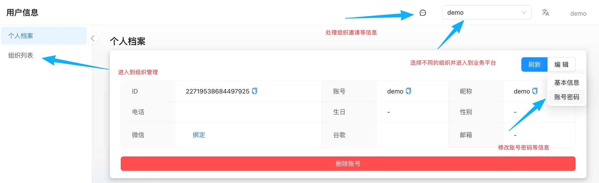

登录成功后，用户可通过“个人中心”管理个人信息、切换组织及处理系统消息。

## 使用入口
+ 首次登录时，系统将自动跳转至用户信息设置页面。
+ 后续如需修改信息，可随时点击顶部导航栏的“个人中心”进入信息管理界面。

<!-- 这是一张图片，ocr 内容为：用户信息 DEMO DEMO 处理组织邀请等信息 个人档案 个人档案 组织列表 选择不同的组织并进入到业务平台 编辑 刷新 进入到组织管理 基本信息 ID 22719538684497925 昵称 账号 DEMO D DEMO  账号密码 电话 生日 性别 邮箱 微信 绑定 谷歌 修改账号密码等信息 删除账号 -->

## 功能说明
+ ✅ **组织切换**  
支持在已加入的多个组织间进行切换，选择不同的组织可进入对应的业务平台界面，查看和管理该组织下的资源。
+ ✅**信息编辑**  
点击“编辑”按钮，可修改用户的昵称、头像等基本信息，并支持更改登录密码。
+ ✅**消息通知**  
点击消息图标，可查看并处理系统通知，如组织邀请、审批请求等重要信息。
## 账号密码管理
路径：`个人中心` → `用户信息` → `个人档案` → `编辑` → `账号密码`

### 操作步骤
1. 进入“个人档案”菜单。
2. 点击“编辑”按钮，展开详细信息编辑面板。
3. 在“账号密码”区域点击修改，系统将弹出密码修改对话框。
4. 输入当前密码、新密码及确认密码，提交后即可完成密码更新。

> **注**：用户账号名称必须在系统范围内保持唯一。
