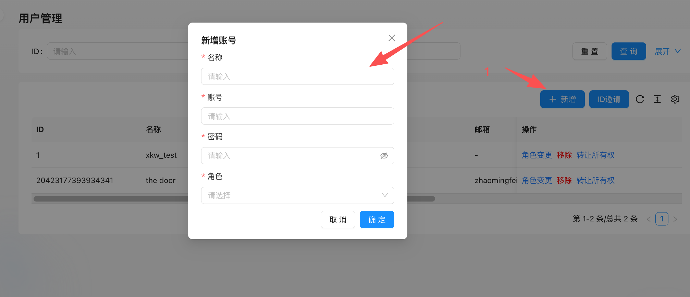

# 1. 用户管理
## 1.1. 新增用户
**操作路径**：系统管理 → 用户管理 → 新增用户
1. 点击**“新增用户”** 按钮，弹出用户创建表单。
2. 填写登录账号（通常为邮箱或手机号）、设置初始密码。
3. 选择要绑定的角色权限。
4. 点击保存完成用户创建。
新创建的用户首次登录时，系统将提示其完善个人信息（如姓名、联系方式等），以确保账户信息完整可用。
<!-- 这是一张图片，ocr 内容为：用户管理 新增账号 重置 查询 展开 请输入 ID: 名称 请输入 账号 冷工 十新增 ID邀请 请输入 邮箱 ID 名称 操作 密码 角色变更移除转让所有权 请输入 XKW_TEST 角色 ZHAOMINGFEI 角色变更移除转让所有权 THE DOOR 20423177393934341 请选择 第1-2条/总共2条 确定 取消 -->

## 1.2. 邀请用户
**操作路径**：系统管理 → 用户管理 → 邀请用户
1. 点击**“邀请用户”** 按钮，弹出邀请对话框。
2. 输入目标用户的账号（支持邮箱或手机号）。
3. 从下拉列表中选择拟授予的角色权限。
4. 点击确认发送邀请。
受邀用户将在 ThinkLink 系统消息中收到邀请通知，点击**“接受邀请”** 后即可加入该组织，并获得相应权限。
> <!-- 这是一张图片，ocr 内容为：大门测试有限公司 用户管理 ID  邀请 重置 查询 展开 请输入 ID: 用户ID 请选择 角色 新增 ID邀请 请选择 操作 邮箱 ID 邀请消息 角色变更 转让所有权 移除 请输入 ZHAOMINGFEI 角色变更移除转让所有权 20423177393934341 取消 确定 第1-2条/总共2条 -->

>

## 1.3. 角色变更
在用户管理列表中，每个用户条目右侧均设有操作菜单。  
点击**“角色变更”** 可修改该用户当前所属角色：
1. 弹出角色选择框。
2. 选择新的角色后提交更改。
3. 更改即时生效，无需重启或刷新。
适用于人员职责调整、项目协作变化等场景。
## 1.4. 转让所有权
**权限说明**：仅当前组织的所有者可见并可操作此功能。
在用户操作菜单中点击**“转让所有权”**：
1. 系统弹出所有权转让确认框。
2. 选择目标用户（必须是本组织内已存在的成员）。
3. 进行二次确认后，所有权即转移至新用户。
原所有者将降级为普通管理员或所分配角色对应权限级别。
> 【警告】所有权转让操作不可逆，请谨慎执行。
>
